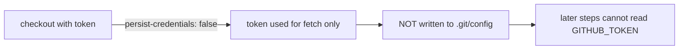

## Summary

The `quality` job's `actions/checkout` step in `.github/workflows/ci.yml` ran
without `persist-credentials: false`, so `actions/checkout` wrote the workflow
`GITHUB_TOKEN` into `.git/config` as an auth header. Any later step in the job —
including a compromised dependency or injected script — could read it and act as
the token. The `quality` job only reads the tree (fmt, clippy, check, build,
test) and never pushes back or fetches private submodules, so it does not need
the persisted credential.

Added `persist-credentials: false` to that checkout step so the token is used
only for the initial fetch and is never written to disk, narrowing the blast
radius of a compromised step. Closes #1568.

## Evidence

Backend/CI-only change — there is no web interface to screenshot. Verified via a
new plain-text validation test that parses `ci.yml` and asserts the `quality`
job's checkout step disables credential persistence.



Test run:

```
test quality_checkout_disables_persist_credentials ... ok
test result: ok. 1 passed; 0 failed
```

The pre-existing workflow-validation tests (`issue_1286`, `issue_1288`,
`issue_1564`) still pass, confirming the edit did not regress other ci.yml
invariants.

## Test Plan

- Added `tests/issue_1568_quality_persist_credentials.rs::quality_checkout_disables_persist_credentials`,
  which reproduces the finding (fails against the unfixed workflow) and passes
  after adding `persist-credentials: false`.
- Re-ran `issue_1286_workflow_permissions`, `issue_1288_workflow_concurrency`,
  and `issue_1564_ci_no_push_trigger` to confirm no regressions.
