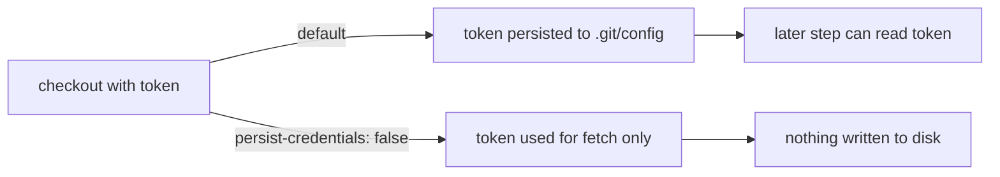

## Summary

Hardened the `spell-check` job in `.github/workflows/ci.yml` by adding
`persist-credentials: false` to its `actions/checkout` step. By default checkout
writes the workflow `GITHUB_TOKEN` into `.git/config` as an auth header, where any
later step in the job (including a compromised dependency) could read it and act
as the token. The `spell-check` job only runs codespell over the tree — it never
pushes back to the repository nor fetches private submodules — so the persisted
credential is unnecessary and only widens the blast radius of a compromised step.

This mirrors the existing hardening already applied to the sibling `quality` job
(Issue #1568). The checkout still receives `token: ${{ secrets.GITHUB_TOKEN }}`
for the initial fetch; `persist-credentials: false` only stops that token being
left on disk afterwards.

Closes #1569.

## Evidence

Backend/CI configuration change — no web interface to screenshot.

Verified with `python3 -c "import yaml; yaml.safe_load(open('.github/workflows/ci.yml'))"`
→ `YAML OK`, confirming the workflow still parses after the edit.



Diff (the only change):

```yaml
      with:
        ref: ${{ github.head_ref }}
        fetch-depth: 0
        token: ${{ secrets.GITHUB_TOKEN }}
        # This job only reads the tree (codespell) and never pushes back, so
        # the token must not be written to .git/config where a later
        # compromised step could read it (Issue #1569).
        persist-credentials: false
```

## Test Plan

- YAML syntax validated with `yaml.safe_load` — workflow parses cleanly.
- Confirmed the `spell-check` job runs only `codespell` and has no push-back or
  private-submodule step, so removing the persisted credential is safe (no
  suppression comment warranted).
- No Rust source changed, so `quality.sh`'s build/test gates are unaffected.
