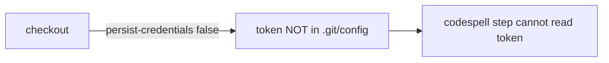

## Summary

The `spell-check` job in `.github/workflows/ci.yml` ran `actions/checkout`
without `persist-credentials: false`. By default checkout writes the workflow's
`GITHUB_TOKEN` into `.git/config` as an auth header, where any later step in the
job — including a compromised dependency or injected script — can read it and
act as the token. The job only runs codespell over the tree; it never pushes
back to the repository nor fetches a private submodule, so it does not need the
persisted credential. Setting `persist-credentials: false` keeps the token off
disk and narrows the blast radius of a compromised step. Closes #1569.

## Evidence

Backend/CI change only — no web interface to screenshot.

Before: the checkout step relied on the default `persist-credentials: true`,
writing `GITHUB_TOKEN` to `.git/config`. After: the token is not persisted.



Test results:

```
test spell_check_checkout_disables_credential_persistence ... ok
test result: ok. 1 passed; 0 failed
```

`./quality.sh` passes cleanly (fmt, clippy, check, full test suite, release
build).

## Test Plan

- Added `tests/issue_1569_spell_check_persist_credentials.rs` — locates the
  `spell-check` job block in `ci.yml` and asserts its checkout step sets
  `persist-credentials: false`. The test fails against the unfixed workflow and
  passes after the change.
