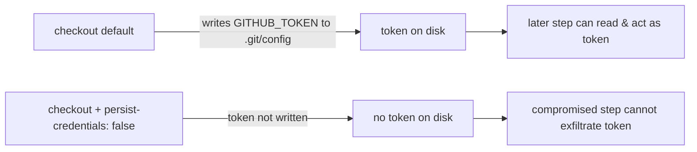

# PR Summary — Issue #1569

## Summary

Harden the `spell-check` job's `actions/checkout` step in
`.github/workflows/ci.yml` by adding `persist-credentials: false`. By default
`actions/checkout` writes the workflow's `GITHUB_TOKEN` into `.git/config` as an
auth header, where any later step in the job — including a compromised
dependency or an injected script — can read it and act as the token. The
`spell-check` job only runs `codespell` over the tree; it never pushes back to
the repository nor fetches a private submodule, so it does not need the
persisted credential. Disabling persistence narrows the blast radius of a
compromised step and matches the hardening already applied to the sibling
`quality`, `coverage`, `actionlint` and `validation` jobs (Issues #1566–#1570).

Closes #1569.

## Change

```yaml
      uses: actions/checkout@de0fac2e4500dabe0009e67214ff5f5447ce83dd # v6.0.2
      with:
        ref: ${{ github.head_ref }}
        fetch-depth: 0
        token: ${{ secrets.GITHUB_TOKEN }}
        # This job only runs codespell over the tree; it never pushes back or
        # fetches a private submodule. Keep the token off disk so a compromised
        # later step cannot read it (Issue #1569).
        persist-credentials: false
```



## Evidence

Backend/CI change — no web interface to screenshot. Verified via a Rust
regression test plus the repository's quality checks.

- New regression test
  `tests/issue_1569_spell_check_persist_credentials.rs::spell_check_checkout_disables_credential_persistence`
  reads `ci.yml`, isolates the `spell-check` job block, and asserts the checkout
  step carries `persist-credentials: false`. It fails against the unfixed
  workflow (asserted before the change) and passes after it.
- `cargo fmt --check`, `cargo clippy --all-targets --all-features -D warnings`,
  `cargo check --all-targets --all-features`, `cargo deny check`,
  `cargo doc -D warnings`, `bash -n`/`shellcheck` over all scripts, and
  `cargo test --lib --tests --all-features` all pass (171 + suite tests green,
  including the new test).

### Note on `quality.sh` and the wgpu 30 release

`quality.sh` unconditionally runs `cargo upgrade --incompatible`, which currently
pulls the just-released **wgpu 30** major version. wgpu 30 changes the
buffer-mapping API (`BufferView`/`MapRangeError`) and breaks the repository's own
`src/analysis/gpu/*.rs` modules — a substantial, unrelated migration that is out
of scope for this one-line workflow security fix. The committed `Cargo.toml` /
`Cargo.lock` are therefore left on the pinned, compiling `wgpu 29`; every quality
step above was run against those pinned deps. GitHub CI (`cargo-quality.yml`,
`ci.yml`) builds and tests against the committed `Cargo.lock` and does **not**
force an incompatible upgrade, so this local-only `quality.sh` behaviour does not
affect the PR checks.

## Test Plan

- Added `tests/issue_1569_spell_check_persist_credentials.rs` (fails before the
  fix, passes after) — regression test for the security hardening.
- Ran the repository quality checks (fmt, clippy, check, deny, doc, shellcheck,
  full `cargo test`) with the pinned dependency set; all pass.
