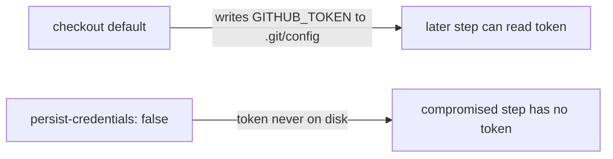

# Disable persist-credentials on the `validation` job checkout

## Summary

The `validation` job in `.github/workflows/ci.yml` ran `actions/checkout`
without `persist-credentials: false`. By default `actions/checkout` writes the
workflow's `GITHUB_TOKEN` into `.git/config` as an auth header, where any later
step in the job — including a compromised dependency or an injected script —
can read it and act as the token.

The `validation` job only reads the tree (checks for required files, validates
`Cargo.toml` fields, and checks documentation) and never pushes back to the
repository or fetches private submodules, so it does not need the persisted
credential. Adding `persist-credentials: false` keeps the token off disk and
narrows the blast radius of a compromised step, matching the pattern already
applied to the `quality` job (Issue #1568).

Closes #1570.

## Change

```yaml
    - name: Checkout code
      uses: actions/checkout@de0fac2e4500dabe0009e67214ff5f5447ce83dd # v6.0.2
      with:
        persist-credentials: false
```



## Evidence

Backend/CI-only change — no web interface to screenshot.

- New regression test `tests/issue_1570_validation_persist_credentials.rs`
  fails against the unfixed workflow and passes after the fix.
- `cargo test --test issue_1570_validation_persist_credentials` → 1 passed.
- Existing workflow guards stay green:
  `tests/issue_1568_quality_persist_credentials.rs` (1 passed) and
  `tests/issue_1292_actionlint_workflow.rs` including
  `actionlint_workflow_checkout_disables_persist_credentials` (8 passed).
- `cargo fmt --all --check`, `cargo clippy --all-targets --all-features -- -D
  warnings`, and `cargo build` all pass on the pinned dependency set.

### Note on `quality.sh`

`quality.sh` runs `cargo upgrade --incompatible`, which bumps `wgpu` 29 → 30 (a
breaking major release) and fails to compile the pre-existing `src/analysis/gpu`
code. That breakage is unrelated to this security fix and out of scope; the
dependency reverted to the pinned versions builds and tests cleanly. The wgpu 30
API migration should be handled as its own change.

## Test Plan

- Added `tests/issue_1570_validation_persist_credentials.rs`:
  `validation_checkout_disables_persist_credentials` — reads `ci.yml`, extracts
  the `validation` job block, and asserts its `actions/checkout` `with:` block
  declares `persist-credentials: false`.
- Verified the test fails before the workflow edit and passes after.
