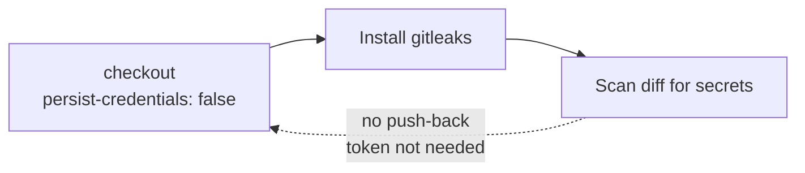

## Summary

Hardened the `gitleaks` workflow checkout step by adding `persist-credentials: false`.
By default `actions/checkout` writes the workflow's `GITHUB_TOKEN` into `.git/config`
as an auth header, where any later step in the job could read it and act as the token.
The `gitleaks` job only reads the PR diff and never pushes back to the repository or
fetches private submodules, so it does not need the persisted credential. Removing it
narrows the blast radius of a compromised step. Closes #1571.

## Evidence

Backend/CI-only change — there is no web interface to screenshot.

- The `gitleaks` job scans the diff via `gitleaks detect --log-opts <base>..<head>`
  against the already-fetched history (`fetch-depth: 0`); it performs no `git push`
  and clones no private submodule, so no persisted credential is required.
- Workflow YAML validated with `yaml.safe_load` — parses cleanly.

## Test Plan

- Validated `.github/workflows/gitleaks.yml` parses as valid YAML.
- Confirmed the checkout step now sets `persist-credentials: false` while retaining
  `fetch-depth: 0` needed for the diff scan.
