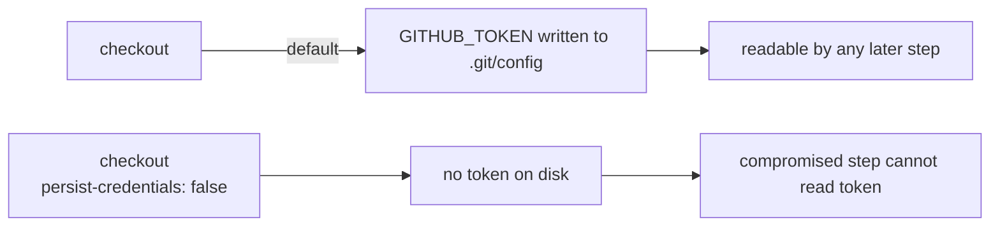

# PR Summary — Issue #1572

## Summary

The `markdownlint` job in `.github/workflows/markdown-lint.yml` ran
`actions/checkout` without `persist-credentials: false`. By default checkout
writes the workflow's `GITHUB_TOKEN` into `.git/config` as an auth header,
where any later step in the job — including a compromised dependency or an
injected script — can read it and act as the token. This lint-only job never
pushes back to the repository nor fetches a private submodule, so it does not
need the persisted credential; keeping it on disk only widens the blast radius
of a compromised step.

This PR adds `persist-credentials: false` to the checkout step so the token is
never written to disk, and adds a regression test asserting the setting is
present. Closes #1572.

## Change

```yaml
      - uses: actions/checkout@93cb6efe18208431cddfb8368fd83d5badbf9bfd
        with:
          # Lint-only job: no push-back or private submodule fetch, so the
          # GITHUB_TOKEN must not be persisted to .git/config (Issue #1572).
          persist-credentials: false
```

## Evidence

Backend/CI-only change — no web interface to screenshot. Verified via:

- `cargo test --test issue_1572_markdown_lint_persist_credentials` — passes.
- `cargo test --test issue_1292_actionlint_workflow` — all 8 workflow-hardening
  assertions still pass.
- `actionlint .github/workflows/markdown-lint.yml` — clean.
- `cargo fmt --check` and `cargo clippy` on the new test — clean.



## Test Plan

- Added `tests/issue_1572_markdown_lint_persist_credentials.rs` —
  `markdownlint_checkout_disables_credential_persistence` reads
  `markdown-lint.yml`, isolates the `markdownlint` job block, and asserts the
  checkout step carries `persist-credentials: false`. This test fails against
  the pre-fix workflow and passes after the fix.

## Note

`quality.sh` runs `cargo upgrade --incompatible`, which bumps `wgpu` 29→30 and
breaks unrelated GPU code (`src/analysis/gpu/relu_evaluation.rs`) at compile
time. That auto-upgrade is out of scope for this credential-persistence fix, so
the unrelated `Cargo.toml`/`Cargo.lock` bump was reverted and not included here.
The change compiles and all relevant tests pass against the repository's pinned
dependencies.
