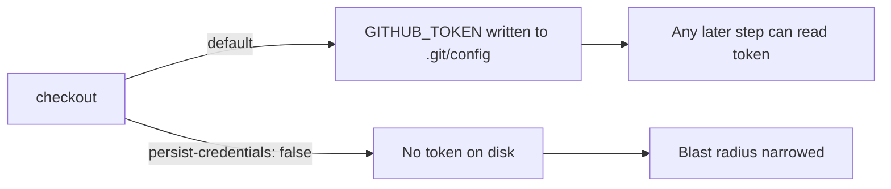

# PR Summary — Issue #1572

## Summary

The `markdownlint` job in `.github/workflows/markdown-lint.yml` ran
`actions/checkout` without `persist-credentials: false`. By default checkout
writes the workflow's `GITHUB_TOKEN` into `.git/config` as an auth header, where
any later step in the job — including a compromised dependency — can read it and
act as the token. This job only lints Markdown; it never pushes back to the
repository nor fetches a private submodule, so the persisted credential is
unnecessary and keeping it on disk only widens the blast radius of a compromised
step.

This PR adds `persist-credentials: false` to the checkout step and a
text-based regression test that asserts the setting is present. Closes #1572.



## Evidence

Backend/CI change — no web interface to screenshot.

- New test `tests/issue_1572_markdownlint_persist_credentials.rs` fails against
  the unfixed workflow and passes after the fix:

  ```
  running 1 test
  test markdownlint_checkout_disables_credential_persistence ... ok
  test result: ok. 1 passed; 0 failed; 0 ignored; 0 measured; 0 filtered out
  ```

- `cargo build` (default features) and
  `cargo clippy --all-targets --all-features -- -D warnings` both pass at the
  committed dependency versions.

### Quality-gate note (out of scope — tracked by #1594)

`./quality.sh` begins with `cargo upgrade --incompatible`, which force-bumps
`wgpu` 29 → 30 (plus `pollster` and `naga`). The repo's existing GPU code
(`src/analysis/gpu/relu_evaluation.rs`) does not compile against wgpu 30, so the
full gate cannot complete cleanly. This is a pre-existing incompatibility
unrelated to this workflow change and is already tracked by
**stSoftwareAU/NEAT-AI-Discovery#1594** (top-priority). This PR keeps the
dependencies at their committed versions, where the tree — including
`--all-features` clippy — is clean; the auto-bump has not been included here.

## Test Plan

- Added `tests/issue_1572_markdownlint_persist_credentials.rs::markdownlint_checkout_disables_credential_persistence`,
  which reads `.github/workflows/markdown-lint.yml`, isolates the `markdownlint`
  job block, and asserts its checkout step carries `persist-credentials: false`.
  This reproduces the finding (fails before the fix) and verifies the fix.
