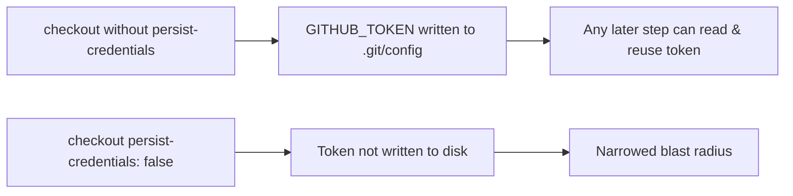

# PR Summary — Issue #1573

## Summary

The `security` job in `.github/workflows/security.yml` checked out the
repository with `actions/checkout` but did not set `persist-credentials: false`.
By default `actions/checkout` writes the workflow's `GITHUB_TOKEN` into
`.git/config` as an auth header, where any later step in the job — including a
compromised dependency or an injected script — can read it and act as the token.

The `security` job only checks out the tree to run the cargo-audit / RustSec /
dependency-review scans; it never pushes back to the repository nor fetches a
private submodule, so it does not need the persisted credential. Disabling
persistence narrows the blast radius of a compromised step.

This change adds `persist-credentials: false` to the checkout step, matching the
established pattern already used by the `ci.yml`, `cargo-quality.yml`,
`actionlint.yml`, and `gitleaks.yml` workflows.

Closes #1573.

## Evidence

This is a CI workflow / configuration change with no web interface to
screenshot. It is verified by a new plain-text assertion test that reads the
real workflow file and confirms the `security` job's checkout step carries
`persist-credentials: false`.

## Test Plan

- Added `tests/issue_1573_security_checkout_persist_credentials.rs` with
  `security_checkout_disables_credential_persistence`, which locates the
  `security` job block in `security.yml` and asserts it still checks out the
  repository and sets `persist-credentials: false`. The test fails against the
  unfixed workflow and passes after the fix.
- `./quality.sh` run clean (fmt, Clippy, cargo check, doc build, tests, build).
