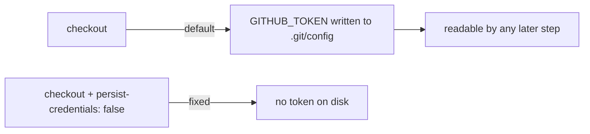

# PR Summary — Issue #1574

## Summary

The `semgrep` job in `.github/workflows/semgrep.yml` ran `actions/checkout`
without `persist-credentials: false`. By default checkout writes the workflow's
`GITHUB_TOKEN` into `.git/config` as an auth header, where any later step in the
job — including a compromised dependency or an injected script — can read it and
act as the token. This job is SAST-only: it checks out the tree to run
`semgrep ci` and never pushes back to the repository nor fetches a private
submodule, so the persisted credential is unneeded and only widens the blast
radius of a compromised step.

Added `persist-credentials: false` to the checkout step, matching the sibling
fixes already applied to `security.yml` (#1573) and `gitleaks.yml` (#1571).

Closes #1574.

## Evidence

Backend/CI change only — no web interface to screenshot. The behaviour is
verified by an integration test plus `actionlint`.

Checkout step before → after:

Verification:

- `cargo test --test issue_1574_semgrep_checkout_persist_credentials` → 1 passed.
- `actionlint .github/workflows/semgrep.yml` → OK.
- `cargo fmt --all -- --check` → clean.
- `cargo clippy --test issue_1574_... --all-features` (`-D warnings`) → clean.
- `cargo build --lib` at the pinned dependency versions → clean.

## Test Plan

- Added `tests/issue_1574_semgrep_checkout_persist_credentials.rs`, which reads
  `semgrep.yml`, isolates the `semgrep` job block, and asserts the checkout step
  carries `persist-credentials: false`. It reproduces the finding: it fails
  against the unfixed workflow and passes after the fix.

## Scope note — quality gate dependency bump

`./quality.sh` runs `cargo upgrade --incompatible`, which bumps `wgpu` 29→30
(plus `pollster`, `naga`). `wgpu` 30 is a breaking API change that fails to
compile the pre-existing GPU code in `src/analysis/gpu/*` (unrelated to this
issue). That incompatible bump is out of scope for this credentials-only fix, so
the PR keeps the pinned dependency versions; the lib builds cleanly at those
pins. The `wgpu` 30 migration is a separate, repo-wide concern.
