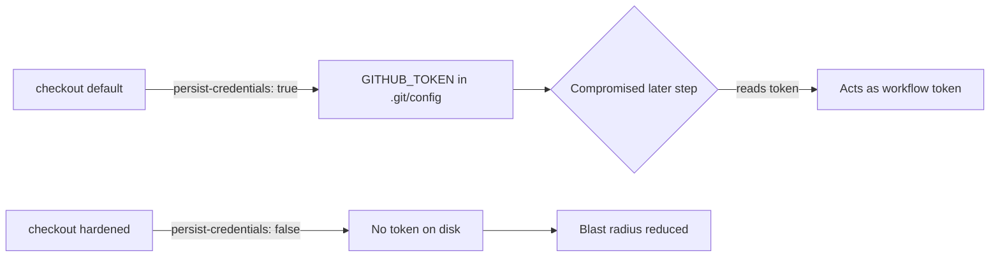

# Disable credential persistence in `shellcheck` checkout

## Summary

The `shellcheck` job in `.github/workflows/shellcheck.yml` ran
`actions/checkout` without `persist-credentials: false`. By default checkout
writes the workflow's `GITHUB_TOKEN` into `.git/config` as an auth header, where
any later step in the job — including a compromised dependency or an injected
script — can read it and act as the token. The `shellcheck` job only reads the
tree to lint bash scripts; it never pushes back to the repository nor fetches a
private submodule, so it does not need the persisted credential. Disabling
persistence narrows the blast radius of a compromised step.

This change adds `persist-credentials: false` to the checkout step, matching the
already-hardened `actionlint`, `security`, `semgrep`, and `gitleaks` workflows
in this repository. Closes #1575.

## Evidence

Backend/CI change with no web interface to screenshot. Verified via a new Rust
test that reads the workflow file and asserts the fix, plus the repository's
bash-syntax and ShellCheck gates:

- `cargo test --test issue_1575_shellcheck_checkout_persist_credentials` — passes.
- Sibling workflow tests (`issue_1573_*`, `issue_1574_*`) still pass.
- `bash -n` syntax check and `shellcheck -s bash` over all scripts — pass.

## Test Plan

- Added `tests/issue_1575_shellcheck_checkout_persist_credentials.rs`, which
  locates the `shellcheck` job block in the workflow and asserts its checkout
  step carries `persist-credentials: false`. The test fails against the unfixed
  workflow and passes after the fix (verified locally).

## Notes for reviewers — dependency bump intentionally omitted

`quality.sh` runs `cargo upgrade --incompatible`, which force-bumps `wgpu`
29→30, `pollster` 0.4→1.0, and `naga` 29→30. That is a breaking major migration
that fails to compile the GPU code (`src/analysis/gpu/*`) across ~9 call sites
and is unrelated to this security fix. It is already tracked by the open
top-priority issue **#1594** ("quality.sh cargo upgrade --incompatible breaks
build: GPU code not migrated to wgpu 30 / pollster 1.0 / naga 30"). Per the
Issue #1613 audit gate (revert a bump that breaks the build), this PR keeps the
working dependency versions so the scoped security fix lands cleanly; the wgpu
30 migration remains with #1594.
