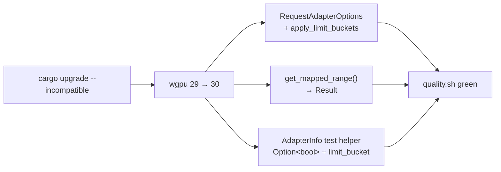

# PR Summary — Issue #1594

## Summary

`quality.sh` runs `cargo upgrade --incompatible` before building, which
force-bumps `wgpu` 29→30, `pollster` 0.4→1.0, `naga` 29→30 and
`parquet`/`arrow` 59.0→59.1. The committed GPU source under
`src/analysis/gpu/*.rs` had not been migrated to the wgpu 30 API, so the build
failed with 9 errors and the local quality gate could not pass — blocking the
#1613 dependency-bump-on-every-PR flow.

This PR migrates the GPU code to the wgpu 30 API and bumps
`Cargo.toml`/`Cargo.lock` to the upgraded versions in the same PR (#1613).
`Closes #1594`.

### Changes

1. **`RequestAdapterOptions` gained a field.** wgpu 30 added
   `apply_limit_buckets: bool`. Added `apply_limit_buckets: false` (the correct
   value for a trusted native app — limit bucketing only matters for
   fingerprint-resistance when exposing `wgpu` to untrusted web content) to each
   initializer: `analyzer.rs` (×2) and `device.rs`.

2. **`Buffer::get_mapped_range()` now returns `Result`.** wgpu 30 changed the
   buffer read-back API to return `Result<BufferView, MapRangeError>`. Each of
   the six read-back paths (`relu_evaluation.rs`, `bias_evaluation.rs`,
   `activation_evaluation.rs` ×2, `harmful_evaluation.rs`,
   `helpful_evaluation.rs`) now unwraps that `Result` with `.context(...)?`
   **before** `bytemuck::cast_slice`. All six enclosing functions already return
   `anyhow::Result`, so a map failure now surfaces loudly (Issue #3234 — never
   fail silently) instead of being masked.

3. **`AdapterInfo` test helper updated for wgpu 30.** In `device.rs`,
   `transient_saves_memory` changed from `bool` to `Option<bool>`
   (`Some(false)`), and the new `limit_bucket: Option<AdapterLimitBucketInfo>`
   field was added as `None`.

4. **`pollster` 1.0 and `naga` 30 verified.** `pollster::block_on` usage
   compiles unchanged under 1.0; the `naga` 30 (`wgsl-in`) shader
   parse/validate tests in `shaders.rs` compile and pass unchanged.



## Evidence

Backend/GPU library change — no web interface to screenshot. Verification is via
the full quality gate, which reproduces the original failure path
(`cargo upgrade --incompatible` → build) and now passes end-to-end:

- **Before:** 9 compile errors (3× `E0063 missing field apply_limit_buckets`,
  6× `E0308 mismatched types` at the `get_mapped_range` call sites), plus 2
  further test-only errors surfaced by `--all-targets` (`AdapterInfo`).
- **After:** `./quality.sh < /dev/null` passes cleanly — `cargo deny`, debug
  build, `cargo fmt`, `clippy -D warnings`, `cargo check --all-targets
  --all-features`, full test suite, `cargo doc -D warnings`, and release build.

Test suite (unchanged, now compiling and passing against wgpu 30 / naga 30):

```
test result: ok. 171 passed; 0 failed  (lib)
test result: ok. 289 passed; 0 failed
test result: ok. 236 passed; 0 failed
... (all suites green, 0 failed)
```

## Test Plan

No new synthetic test was added: this is a dependency-migration/build fix, and
the repo's guidance forbids source-grep tests. The regression guard is the
existing suite compiling and passing against the upgraded deps — it fails on the
unfixed tree (build errors) and passes after the migration. Specifically:

- The wgpu 30 `AdapterInfo` construction is exercised by the existing
  `src/analysis/gpu/device.rs` tests (via the `test_adapter_info` helper, which
  would not compile with the old field set).
- The `naga` 30 `wgsl-in` parse/validate path is exercised by the existing
  shader-validation tests in `src/analysis/gpu/shaders.rs`.
- The GPU buffer read-back paths run only on real hardware; their correctness is
  covered by the existing GPU-gated tests where a device is available.
