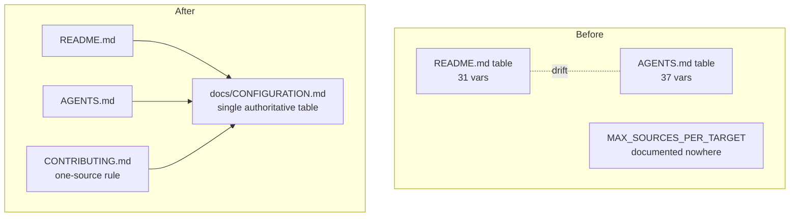

## Summary

The `NEAT_AI_DISCOVERY_*` environment-variable reference was hand-maintained in
**two** tables — `README.md` (`## ⚙️ Configuration`) and `AGENTS.md`
(`## 10. Environment Variables`) — and they had drifted apart: the README
documented 31 variables, AGENTS documented 37, and `NEAT_AI_DISCOVERY_MAX_SOURCES_PER_TARGET`
(Issue #1542) appeared in neither.

This change establishes a **single source of truth**:

- Added **`docs/CONFIGURATION.md`** — the one authoritative reference. It folds
  together every variable from both former tables, adds the previously
  undocumented `NEAT_AI_DISCOVERY_MAX_SOURCES_PER_TARGET`, and groups the knobs
  by concern (logging, GPU, streaming, focus ranking, analysis budget, candidate
  generation, drought/novelty escalation, memory gates).
- Replaced the `README.md` env-var table with a one-line pointer to the new doc
  and indexed it under **Additional Documentation**.
- Replaced the `AGENTS.md` `## 10. Environment Variables` table with a pointer.
- Added a **CONTRIBUTING.md** note that new variables are documented in exactly
  one place so the tables cannot drift again.

The README troubleshooting table (which references a few variables in
problem/solution context, not as a config reference) is left untouched.

Closes #1611.



## Evidence

Documentation-only change plus a documentation-consistency test — no runtime
surface or UI to screenshot. Verified by the new test suite
`tests/issue_1611_env_var_single_source.rs`, which asserts the canonical doc
documents every variable, that README/AGENTS no longer carry a duplicate table
but link to the canonical doc, and — as an anti-drift guard — that every
variable still named anywhere in README/AGENTS prose is present in
`docs/CONFIGURATION.md`.

```
running 8 tests
test agents_points_at_the_canonical_configuration_doc ... ok
test agents_no_longer_carries_the_duplicate_env_var_table ... ok
test configuration_doc_includes_the_previously_undocumented_variable ... ok
test contributing_documents_the_single_source_rule ... ok
test configuration_doc_documents_every_canonical_variable ... ok
test every_variable_named_in_readme_or_agents_is_in_the_canonical_doc ... ok
test readme_no_longer_carries_the_duplicate_env_var_table ... ok
test readme_points_at_the_canonical_configuration_doc ... ok

test result: ok. 8 passed; 0 failed
```

`markdownlint-cli2` reports 0 errors across the changed docs; `cargo fmt --check`
and `cargo clippy -D warnings` on the new test are clean.

## Test Plan

- Added `tests/issue_1611_env_var_single_source.rs`:
  - `configuration_doc_documents_every_canonical_variable` — the 47-variable
    union is all present in `docs/CONFIGURATION.md`.
  - `configuration_doc_includes_the_previously_undocumented_variable` —
    `NEAT_AI_DISCOVERY_MAX_SOURCES_PER_TARGET` is now documented.
  - `readme_points_at_the_canonical_configuration_doc` /
    `agents_points_at_the_canonical_configuration_doc` — both link to the doc.
  - `readme_no_longer_carries_the_duplicate_env_var_table` /
    `agents_no_longer_carries_the_duplicate_env_var_table` — the old tables are
    gone.
  - `every_variable_named_in_readme_or_agents_is_in_the_canonical_doc` —
    anti-drift guard against a future variable being named without a canonical
    entry.
  - `contributing_documents_the_single_source_rule` — CONTRIBUTING.md names the
    single home for env vars.
