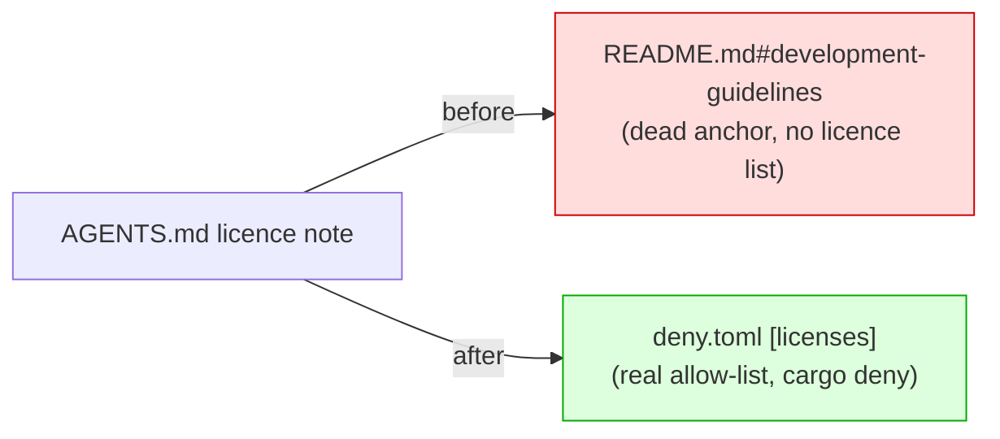

## Summary

`AGENTS.md` linked to a `README.md` section anchor that does not exist —
`[README.md — Dependency License Requirements](README.md#development-guidelines)`
"for the full list of allowed licences". The README has no
`## Development Guidelines` heading (`#development-guidelines` does not resolve)
and carries no allowed-licence list at all; the allow-list is enforced by
`cargo deny` via the `[licenses]` table in `deny.toml`. The link was worse than
dead — it promised an authoritative list the README never contained, sending
agents down a false trail.

This PR repoints that reference to the real source of truth (`deny.toml`) and
adds a regression test that validates every `README.md#anchor` cross-reference
in `AGENTS.md` resolves to a real README heading.

The second anchor called out in the issue (GPU tuning at the reported
`AGENTS.md:670`) was already fixed in a prior change: the current
`AGENTS.md` links to `README.md#gpu-requirement`, which resolves correctly, so
no edit was needed there. The new anchor-integrity test confirms it stays valid.

Fixes #1612.

## Evidence

Backend/docs change — no web interface to screenshot. Verified via the new
Rust test suite, which reproduces the broken cross-reference and confirms the
fix:

- Before the fix, `every_agents_readme_anchor_resolves` failed with
  `AGENTS.md links to README.md#development-guidelines, but no such heading
  anchor exists in README.md`.
- After the fix, all three tests pass.

## Test Plan

Added `tests/issue_1612_agents_readme_anchors.rs`:

- `every_agents_readme_anchor_resolves` — derives README heading anchors with a
  GitHub-style slugger and asserts every `README.md#anchor` link in `AGENTS.md`
  resolves (guards all cross-references against future drift).
- `broken_development_guidelines_anchor_is_gone` — asserts the specific broken
  `README.md#development-guidelines` anchor is no longer present.
- `licence_reference_points_at_deny_toml` — asserts `AGENTS.md` references
  `deny.toml` and that `deny.toml` carries the `[licenses]` allow-list.

Full `./quality.sh` gate run clean (fmt, clippy, check, tests, release build).
