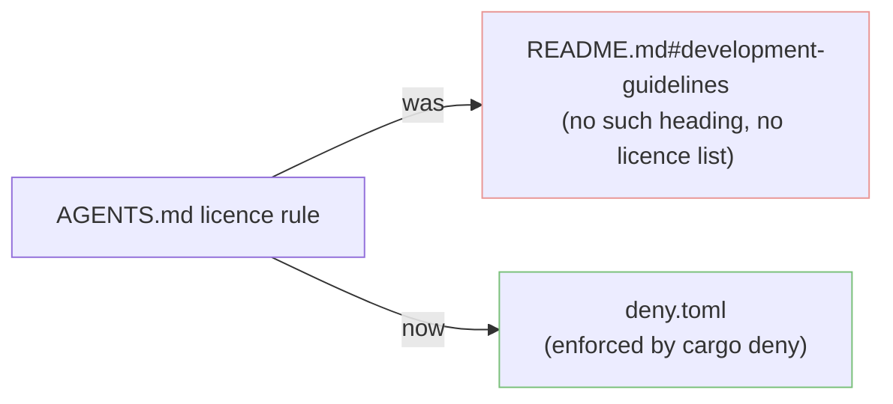

## Summary

`AGENTS.md` linked the dependency-licence guidance to a **non-existent** README
anchor — `[README.md — Dependency License Requirements](README.md#development-guidelines)`
"for the full list of allowed licences". The README has no
`## Development Guidelines` heading (the anchor does not resolve) and carries no
allowed-licence list at all, so an agent verifying a dependency's licence was
sent down a dead, false trail. The licence allow-list is actually enforced by
`cargo deny` via `deny.toml` (see `quality.sh` step 3).

This PR repoints that link at the authoritative source and adds a
cross-reference-integrity test so the class of bug cannot recur.

- `AGENTS.md:345` — replaced the broken README-anchor link with
  [`deny.toml`](deny.toml), noting it is enforced by `cargo deny` in
  `quality.sh`.

The second link flagged in the issue (`README.md#gpu-performance-tuning` at the
old line 670) was **already fixed** in the current tree — it now reads
`[README.md — GPU Requirement](README.md#gpu-requirement)` and links
`docs/GPU_GUIDE.md` for tuning. The new integrity test guards it against
regression.

Closes #1612.

## Evidence

Documentation/link-integrity change only — no web interface to screenshot. The
fix is verified by unit tests that slugify every README heading (GitHub-style)
and assert every `README.md#anchor` link in `AGENTS.md` resolves.



Test run:

```
running 4 tests
test agents_points_licence_allow_list_at_deny_toml ... ok
test agents_does_not_link_the_non_existent_development_guidelines_anchor ... ok
test sanity_check_known_readme_anchors_resolve ... ok
test every_agents_readme_anchor_link_resolves ... ok

test result: ok. 4 passed; 0 failed
```

`./quality.sh` passes cleanly.

## Test Plan

Added `tests/issue_1612_agents_link_integrity.rs`:

- `every_agents_readme_anchor_link_resolves` — extracts every `README.md#anchor`
  link from `AGENTS.md`, slugifies every README heading the way GitHub does, and
  asserts each link resolves (reproduces the broken cross-reference; fails
  against the unfixed `AGENTS.md`).
- `agents_does_not_link_the_non_existent_development_guidelines_anchor` —
  regression guard for the specific dead anchor.
- `agents_points_licence_allow_list_at_deny_toml` — asserts the licence guidance
  names the authoritative source, `deny.toml`.
- `sanity_check_known_readme_anchors_resolve` — pins the slugifier against the
  known-good `#development`, `#gpu-requirement`, `#troubleshooting`,
  `#additional-documentation` anchors.
