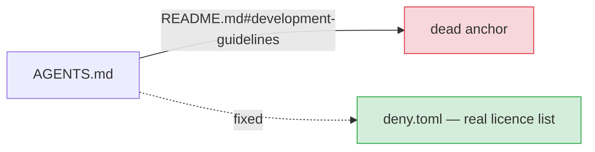

# Fix broken README cross-references in AGENTS.md (Issue #1612)

## Summary

`AGENTS.md` linked its dependency-licence policy to
`README.md#development-guidelines` — an anchor that does not resolve, because the
README has no `## Development Guidelines` heading and carries no allowed-licence
list anywhere. The link promised an authoritative "full list of allowed licences"
that did not exist, sending agents down a false trail instead of `deny.toml`
(the real list, enforced by `cargo deny` in `quality.sh`).

The fix repoints that link to `deny.toml`:

- **Before:** `[README.md — Dependency License Requirements](README.md#development-guidelines)`
- **After:** `` [`deny.toml`](deny.toml) `` — "for the full list of allowed licences, enforced by `cargo deny` in `quality.sh`".

The second link the issue flagged (`README.md#gpu-performance-tuning`) was already
corrected in an earlier change: AGENTS.md now links `README.md#gpu-requirement`
and `docs/GPU_GUIDE.md` for tuning, both of which resolve. No further edit was
needed there; the new anti-drift test covers it going forward.

Closes #1612.

## Evidence

Backend/documentation change — no web interface to screenshot. Verified via a new
Rust test suite that derives README anchors from its headings (GitHub slug rules:
lowercase, drop emoji/punctuation, spaces → hyphens) and asserts every
`README.md#anchor` link in AGENTS.md resolves.

All README anchor links in AGENTS.md now resolve:

| AGENTS.md link | Resolves? |
| --- | --- |
| `README.md#gpu-requirement` | ✅ `## 🖥️ GPU Requirement` |
| `README.md#additional-documentation` | ✅ `## 📚 Additional Documentation` |
| ~~`README.md#development-guidelines`~~ | replaced by `deny.toml` |

`./quality.sh` passes cleanly (clippy `-D warnings`, all tests, doc build,
release build).

## Test Plan

Added `tests/issue_1612_agents_readme_anchors.rs`:

- `readme_anchor_generation_matches_known_headings` — the anchor derivation produces
  `#development`, `#gpu-requirement`, `#troubleshooting`, `#additional-documentation`.
- `readme_has_no_development_guidelines_anchor` — the README has no
  `#development-guidelines` heading (guards the false anchor).
- `every_agents_readme_anchor_link_resolves` — every `README.md#…` link in
  AGENTS.md maps to a real README anchor (fails against the unfixed AGENTS.md).
- `agents_does_not_link_the_dead_licence_anchor` — the dead
  `README.md#development-guidelines` link is gone.
- `agents_points_licence_policy_at_deny_toml` — the licence policy now names
  `deny.toml`.

The three link-integrity tests failed against the unfixed AGENTS.md and pass
after the fix.
