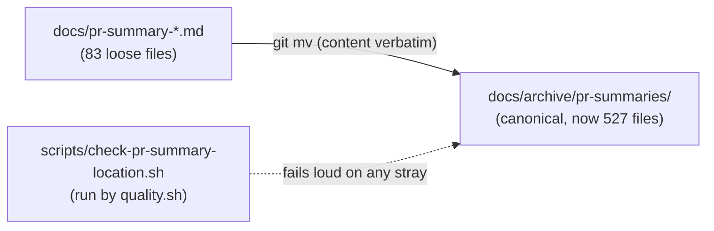

# PR Summary — Issue #1613

## Summary

`docs/archive/pr-summaries/README.md` and `CONTRIBUTING.md` document the archive
(`docs/archive/pr-summaries/`) as the single canonical home for PR summaries and
claim the consolidation is complete. In reality **83** `pr-summary-*.md` files
(issues 1032–1234) were left loose directly under `docs/`, contradicting that
invariant and splitting the durable learnings across two locations.

This PR makes the documented convention true again:

- **Moved all 83 `docs/pr-summary-*.md` files into `docs/archive/pr-summaries/`
  with `git mv`** — content preserved verbatim (every rename reports 100 %
  similarity), so no learning is lost. The archive now holds 527 summaries; the
  `docs/` root holds none.
- **Updated the `docs/` row in the `AGENTS.md` "Other Key Directories" table**
  so it no longer claims to hold PR summaries and points at the archive instead.
- **Added `scripts/check-pr-summary-location.sh`, wired into `quality.sh`**,
  which fails loud if any `pr-summary-*.md` appears outside
  `docs/archive/pr-summaries/`, so the layout cannot silently regress.
- **Removed the now-dead `docs/pr-summary-*.md` entry** from the
  `.markdownlint-cli2.jsonc` `ignores` list — the archived files are already
  covered by `docs/archive/**`, and the new guard forbids that path.

Closes #1613.

## Evidence

This is a documentation/CLI change with no web interface to screenshot. The
regression guard was verified end-to-end: it failed against the broken tree
(83 strays, exit 1), then passed after the migration (exit 0).

Guard behaviour:

- **Before the move** — `./scripts/check-pr-summary-location.sh` listed all 83
  loose files and exited `1`.
- **After the move** — the same script printed
  `✅ All pr-summary-*.md files live in docs/archive/pr-summaries/` and exited
  `0`.

## Test Plan

- `scripts/check-pr-summary-location.sh` — the executable regression guard. Run
  directly and via `quality.sh`; red against the pre-migration tree, green
  after. Passes `bash -n` and `shellcheck -s bash`.
- `markdownlint-cli2 AGENTS.md` — 0 errors after the table edit.
- Verified no basename collisions between the 83 loose files and the existing
  archive (safe `git mv`), and no remaining references to the old
  `docs/pr-summary-*.md` paths anywhere in the tree.
