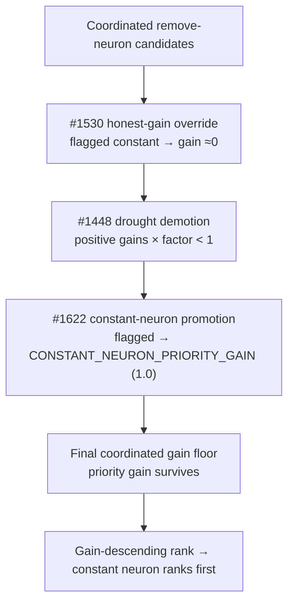

# PR Summary — Issue #1622

## Summary

Promote **zero-variance (functionally-constant) hidden neurons** to priority
remove-neuron candidates so they are taken regardless of the two mechanisms that
currently keep them alive (the #1620 bug):

1. **Propagation-aware gain ranking (#1518)** — a zero-influence neuron gets a
   signed honest gain of ≈0, which never beats positive-gain candidates.
2. **Drought demotion (#1448)** — remove-neuron is further deprioritised during a
   search-exhaustion drought.

A new module `src/analysis/remove_neuron_constant_promotion.rs` overwrites a
flagged constant neuron's `expected_creature_score_gain` with the priority marker
`CONSTANT_NEURON_PRIORITY_GAIN` (`1.0`). The orchestrator runs it **after** the
#1530 honest-gain override and the #1448 drought demotion — so the priority gain
bypasses both — and **before** the final coordinated gain floor, so the promoted
candidate survives. A constant neuron contributes nothing an equivalent bias
adjustment on its targets could not, so promotion is safe independent of the
measured gain; the score-preservation guarantee is provided by the removal
sub-issue's bias-fold + evaluate-before-accept gate.

Promotion is a pure, order-preserving pass that rewrites only flagged single-op
`RemoveNeuron` candidates. Multi-op candidates, non-removal candidates, and — the
over-promotion guard — every *unflagged* neuron are left untouched, so a genuine
positive-gain removal is never displaced and the downstream gain-descending
`total_cmp` sort stays deterministic.

**Scope boundary:** detecting the constant neurons is a sibling sub-issue.
`functionally_constant_neuron_uuids` is the orchestrator's consumption seam for
that detector's flag set; until it is wired the set is empty and the promotion is
a documented no-op (an empty set means "no constant neuron detected this pass" —
not a masked fault).

Closes #1622.

## Evidence

Backend/CLI change — no web interface to screenshot. Verified via the new unit
and integration tests (`cargo test`), which is the earliest detection point named
in the issue's Failure Detection section.

Pipeline stage where promotion hooks in:

Test results (this change): 7 module unit tests + 4 integration tests pass;
`cargo clippy -D warnings`, `cargo fmt --check`, `cargo doc`, and
`cargo build --release` all clean. The only quality-gate failure is the
pre-existing, timing-sensitive `focus::tests::focus_ranking_aborts_when_budget_exceeded`,
which is flaky on the unchanged baseline (fails ~half of runs without this change)
and is unrelated to `analysis/`.

## Test Plan

New integration test `tests/issue_1622_constant_neuron_priority.rs` — the primary
tripwire, covering all four Failure Detection modes:

- `promotion_bypasses_honest_gain_ranking` — a flagged neuron dropped to ≈0 by the
  #1518 honest gain is promoted and ranks ahead of positive-gain candidates.
- `promotion_survives_drought_demotion` — the same flagged neuron under a simulated
  search-exhaustion drought (#1448 active) is still surfaced with priority.
- `promotion_ordering_is_deterministic` — two runs over the same mix yield an
  identical interleaving order.
- `unflagged_zero_gain_neuron_is_not_promoted` — the over-promotion guard: an
  unflagged ≈0-gain neuron keeps its honest gain and does not displace a genuine
  positive-gain candidate.

Unit tests in `src/analysis/remove_neuron_constant_promotion.rs`:

- `promotes_flagged_constant_neuron`, `does_not_promote_unflagged_neuron`,
  `empty_flag_set_is_a_no_op`, `multi_op_candidate_is_not_promoted`,
  `non_removal_candidate_is_not_promoted`,
  `only_flagged_candidate_in_a_mixed_batch_is_promoted`,
  `seam_returns_empty_until_detector_is_wired`.

The existing `remove_neuron_gain` and `remove_neuron_drought` `#[cfg(test)]`
modules continue to pass unchanged, confirming the promotion hook does not alter
ranking or drought behaviour for normal, non-flagged candidates.
