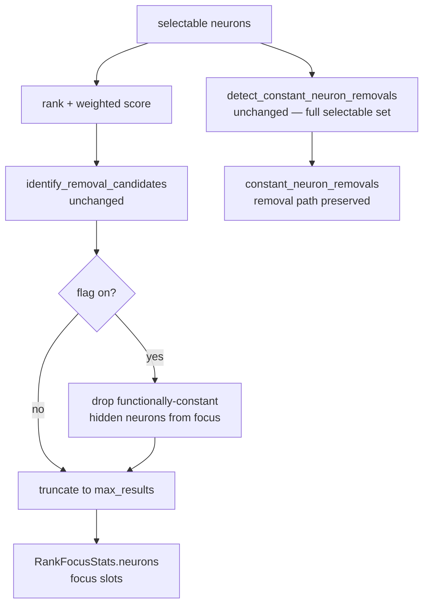

# Investigate whether the fast focus path wastes focus slots on dead/constant neurons (Issue #1624)

## Summary

Investigation **confirmed** the slot-waste hypothesis and ships the recommended
focus-eligibility filter (opt-in). Closes #1624.

The fast focus path ranks every *selectable* neuron, where `is_selectable_type`
(`src/focus/ranking/mod.rs`) excludes only `input` and structural
`constant`-**type** neurons:

```rust
neuron_type != "input" && neuron_type != "constant"
```

It does **not** exclude *functionally*-constant hidden neurons — hidden neurons
whose recorded activation variance is ≈0 (the #1620 class: 15/1,662 in the
reference snapshot output the identical activation on all 200 observations).
Those neurons are ranked into the focus list (`RankFocusStats.neurons`,
truncated to `max_results`) and so consume focus slots. A neuron whose output
never varies cannot yield a successful add-synapse / add-neuron candidate — no
structural change feeding a constant signal moves the network — so **every focus
slot it occupies is wasted**, displacing a productive neuron and directly
starving successful-candidate throughput. This links the two facts #1620's grill
recorded: the same constant neurons that persist unpruned are also silently
eating focus slots.

A live per-neuron variance detector already exists in the same module
(`detect_constant_neuron_removals` + `activation_mean_and_variance_from_records`,
threshold `CONSTANT_VARIANCE_THRESHOLD = 1e-10`, Issues #217/#306) — but only to
*produce removal candidates*. Nothing stops those same neurons from occupying
focus slots. (The #1622 promotion seam `functionally_constant_neuron_uuids` is a
topology-only stub returning an empty set; it cannot detect constancy because
constancy is a property of the *records*, not the creature graph.)

### Recommendation implemented: focus-eligibility filter

New helper `functionally_constant_focus_uuids` (`removal_candidates.rs`) collects
hidden neurons with variance ≤ `CONSTANT_VARIANCE_THRESHOLD` — exactly the set
`detect_constant_neuron_removals` folds into downstream biases. In
`rank_selectable`, when enabled, those UUIDs are removed from the ranked focus
list **after** removal-candidate identification and **without** touching the
`selectable` set fed to `detect_constant_neuron_removals`, so the constant-neuron
*removal* path (#306) is unchanged — the neuron is dropped from focus **and**
still offered for bias-fold removal.

The filter is gated behind `NEAT_AI_DISCOVERY_FOCUS_EXCLUDE_CONSTANT_NEURONS`
(default **off**) so the throughput recovery can be validated on the reference
snapshot before it becomes the default. Default-off also preserves every
existing focus test, whose fixtures use a single constant activation per neuron
(and would otherwise all be classed constant).

### Slot-waste measurement

`RankFocusStats.focus_ineligible_constant` reports the number of constant hidden
neurons excluded per pass, and an `info` log
(`focus::ranking excluded functionally-constant hidden neurons…`) surfaces it at
runtime. This is the reproducible before/after counter:

| Scenario | `h-const` in focus list | `focus_ineligible_constant` |
|----------|-------------------------|-----------------------------|
| Flag **off** (default, "before") | yes — wastes a slot | 0 |
| Flag **on** ("after") | no | 1 |

To reproduce on the #1620 reference snapshot
(`e1336505-…/discovery_data.parquet`, discoveryVersion `0.74.127`): run focus
ranking once with the flag unset and once with
`NEAT_AI_DISCOVERY_FOCUS_EXCLUDE_CONSTANT_NEURONS=1`; the `info` log's
`focus_ineligible_constant` reports the wasted-slot count recovered (expected:
the 15 zero-variance hidden neurons), and the freed slots go to productive
neurons whose successful-candidate rate is measured through the existing
zero-candidate / drought diagnostics.



## Evidence

Backend/library change — no web interface to screenshot. Verified via the new
regression tests plus the full focus suite (167 tests) and `./quality.sh`.

## Test Plan

New `tests/focus/issue_1624_constant_neuron_focus_ineligible.rs`:

- `constant_neuron_is_focus_ineligible_when_flag_enabled` — with the flag on, a
  functionally-constant hidden neuron is **absent** from the ranked focus list,
  a varying neuron **remains**, `focus_ineligible_constant == 1`, and the
  constant neuron is **still** a `constant_neuron_removals` candidate (removal
  path preserved).
- `constant_neuron_consumes_focus_slot_by_default` — the "before" baseline: with
  the flag off (default) the constant neuron **does** occupy a focus slot and
  `focus_ineligible_constant == 0`, documenting the wasted-slot behaviour.

Both are `#[serial]` (env-var mutation). The whole `tests/focus` binary (167
tests) and `cargo clippy -D warnings` pass unchanged, confirming default
behaviour is untouched.
