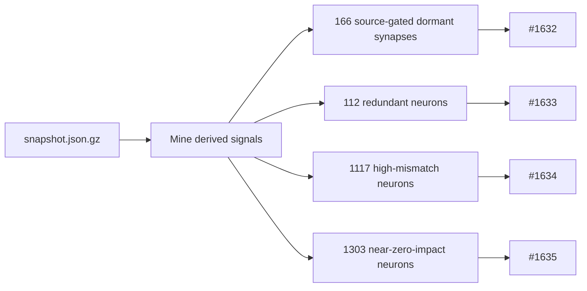

## Summary

Mined the published production snapshot
(`NEAT-AI-Snapshot/docs/snapshot.json.gz` — 1661 hidden neurons, 21 473
synapses, 200 observations), the live production-cluster creature, and the
production discovery cache to explain why the successful-candidate rate has nearly
halted, then raised one evidence-backed child issue per improvement.

Key insight: discovery has collapsed to `remove-neuron` / `change-squash` not
because generators are missing, but because existing detectors' thresholds
exclude the exact structure this creature is full of. This PR commits the
analysis report (`docs/analysis/snapshot-mining-1631.md`) as the shared evidence
base and cross-link for the child issues. Closes #1631.

Child issues raised (all in this repo, cross-linked to #1631):

- **#1632** — dormant-synapse detector gates on weight magnitude, missing **166**
  source-gated dormant synapses (large weight × zero source activation). Fix:
  gate on contribution, not weight.
- **#1633** — new candidate: merge/fold **112** redundant (|r| > 0.999) hidden
  neurons.
- **#1634** — focus selection: add a reconstruction-mismatch signal (**1117**
  neurons with `maxActivationDelta > 0.1`).
- **#1635** — focus selection: impact-magnitude gate (**31.6%** of neurons have
  `|impact| < 1e-6`).

This issue completes once the evidence-backed issues are raised (per its
Current Understanding). The proof gate — a synthetic-creature end-to-end TDD test
per improvement — is carried by each child issue; the real success measure (new
accepted candidates in production) is judged there over days/weeks.

## Evidence

This is a research + issue-raising deliverable with no runtime/UI surface, so
there is no screenshot. The evidence is the mined statistics, each traceable to a
specific field in the published snapshot and reproducible via the commands in
`docs/analysis/snapshot-mining-1631.md`.

## Test Plan

- No Rust behaviour changed — this PR adds documentation only, so existing tests
  are unaffected; `./quality.sh` (build, clippy, tests, doc build) must pass
  unchanged.
- Markdown lint (`markdownlint-cli2`) passes for the new
  `docs/analysis/snapshot-mining-1631.md`.
- The TDD proof tests live in the child issues (#1632–#1635); each specifies a
  failing-test-first plan against a synthetic creature modelled on the production
  structure documented here.
