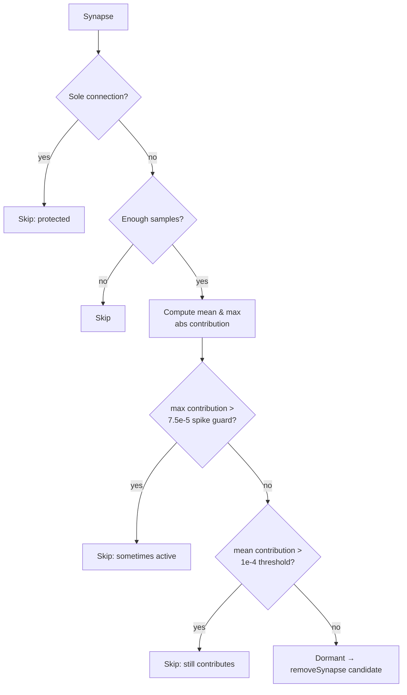

## Summary

The dormant-synapse detector gated on **weight magnitude first**, so a synapse
only ever reached the contribution check if its weight was already tiny
(`|weight| ≤ 1e-4`). But a synapse can carry a large weight and still contribute
nothing when its **source neuron is gated to ~0 across every observation**
(contribution = `weight × source_activation ≈ 0`). Snapshot mining (Issue #1631)
found **166** such fully-dormant, source-gated synapses in the production
GRQ-cluster creature — ~90% of the truly-dormant synapses — all invisible to the
old weight gate, which is why no `removeSynapse` candidates were reaching the
`GRQ-Discovery` cache.

This change makes **contribution the primary dormancy criterion**:

- **Removed** the weight-first `continue` early-exit in
  `detect_dormant_synapses`. Weight magnitude no longer gates dormancy.
- Dormancy is now judged on the **mean absolute contribution** across all
  samples (`DORMANT_CONTRIBUTION_THRESHOLD = 1e-4`), regardless of weight.
- Added a **max-contribution spike guard**
  (`DORMANT_MAX_CONTRIBUTION_THRESHOLD = 7.5e-5`): a synapse whose source spikes
  strongly on even a single observation is **not** flagged, so rarely-but-
  strongly-active synapses are protected from removal.
- Added a `max_abs_contribution` field to `DormantSynapseCandidate` and surfaced
  it in the coordinated-candidate comment for diagnostics.

The sole-connection and minimum-sample guards are unchanged. The NEAT-AI
controller still validates every removal via ablation before applying, so this
only widens the candidate set — it never forces a removal.

Closes #1632.

## Business-logic / test change

`Test 12` (`test_low_activation_does_not_make_active_synapse_dormant` in
`tests/detection/issue_359_dormant_synapse_detection.rs`) previously encoded the
flawed premise that "an active weight protects a synapse even with near-zero
source activation". That premise **is** the bug. The test was **updated (not
deleted)** to assert the corrected contribution-based behaviour:

- a source-gated active-weight synapse (constant near-zero activation) **is**
  now detected as dormant; and
- a synapse whose source spikes on a single observation is **not** flagged
  (max-contribution guard).

Boundary tests `test_weight_above_threshold_not_dormant` (Test 10) and
`test_weight_at_exact_threshold_passes_weight_check` (Test 10b) retain their
original assertions and still pass — Test 10's constant contribution (`1e-4`)
exceeds the spike guard, while Test 10b's (`5e-5`) does not.

## Detection flow

Before this change, an extra `|weight| > 1e-4 → skip` gate sat ahead of the
sample check, hiding every large-weight source-gated synapse.

## Evidence

Backend/CLI change — no UI to screenshot. Verified via the TDD test suite.

`cargo test --test detection dormant -- --test-threads=2` → **38 passed, 0
failed**. Full `./quality.sh` passes (fmt, clippy `-D warnings`, check, doc
build, release build); the lib/test run's only failure was the pre-existing
load-sensitive timing flake `focus::tests::focus_ranking_aborts_when_budget_exceeded`,
which passes in isolation and is unrelated to this change (it lives in `focus`,
not `detection`).

## Test Plan

New tests (`tests/detection/issue_359_dormant_synapse_detection.rs`), modelled on
the production evidence:

- `test_source_gated_large_weight_synapse_is_dormant` — weight `7.0` synapse whose
  source is gated to `0.0` across all 200 observations is detected as dormant
  (models the 166 missed production synapses). **Fails against the unfixed code.**
- `test_single_observation_spike_is_not_dormant` — a source that spikes on 1 of
  200 samples (mean below threshold, max above the guard) is **not** flagged.
- `test_source_gated_synapse_emits_remove_synapse_candidate` — end-to-end:
  `dormant_synapses_to_coordinated_candidates` emits a `removeSynapse` op for a
  source-gated (`-51.77`) synapse.
- `test_source_gated_sole_connection_still_protected` — regression: a source-gated
  large-weight synapse that is the sole input is still protected.

Modified test:

- `test_low_activation_does_not_make_active_synapse_dormant` (Test 12) — updated to
  the corrected contribution-based behaviour plus a max-contribution spike case
  (documented above).

All other existing dormant-synapse tests (small-weight detection, sole-connection
guard, min-sample guard, sorting, coordinated conversion) remain unchanged and
pass.
