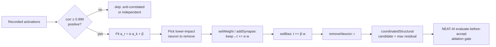

## Summary

Added a new **merge-redundant-neuron** discovery candidate generator that
consolidates redundant hidden neurons. When two hidden neurons carry essentially
the same signal — activations correlated at `|r| > 0.999` — one is pure width: it
costs forward-pass and discovery-analysis budget without adding representational
capacity. The existing `co_adaptation` detector only *observed* this correlation;
it never produced a merge/fold candidate. This generator **folds** the redundant
neuron's per-sample signal into its twin so the neuron can be removed while
preserving the network's output. Closes #1633.

The fold fits the linear relationship `a_remove ≈ α·a_keep + β` by least squares
over the recorded window, then for each outgoing connection `remove → t` with
weight `w`:

- redirects the twin's edge `keep → t` by `α·w` (`setWeight` on an existing edge,
  or `addSynapse` when the twin has no edge to `t`),
- folds the constant `β·w` term into target `t`'s bias (`setBias`), and
- removes the redundant neuron (`removeNeuron`, which drops its remaining
  synapses).

Design decisions, aligned with the issue's TDD plan:

- **Only positive correlation** (`r ≥ 0.999`) is merged — anti-correlated pairs
  are deliberately excluded (production snapshot mining, #1631, found genuine
  duplicates, not opposing pairs).
- The **lower downstream-impact** neuron (`mean|activation| × Σ|outgoing weight|`)
  is folded into its higher-impact twin.
- Each neuron folds **at most once** per pass (strongest-correlation pairs win),
  so the emitted candidates are mutually independent.
- Directly-connected pairs are skipped to avoid creating a self-loop.
- Each candidate carries the **maximum per-sample residual** the fold would
  introduce, so NEAT-AI validates it through the same evaluate-before-accept
  ablation gate as the #1623 bias-fold work — a pair that only *looks* redundant
  is rejected rather than deleted blind.

Wired into the neuron discovery dispatch specs and classified as an **expensive**
(O(n²) pairwise) module for creature-scale tiering, matching co-adaptation.

## Evidence

Backend/Rust-only change — no web interface to screenshot. Verified via unit and
integration tests (below) and the full `./quality.sh` gate (fmt, clippy with
`-D warnings`, type-check, 5200+ tests, release build) passing cleanly.

## Test Plan

Unit tests — `src/analysis/merge_redundant_neuron.rs`:

- `identical_activations_emit_exactly_one_merge_candidate` — two duplicate
  neurons + one independent neuron; asserts exactly one candidate targeting the
  duplicate pair (not the independent neuron), scale ≈ 1, offset ≈ 0, residual ≈ 0.
- `scale_shifted_duplicate_uses_fitted_scale` — `a_dup2 = 2·a_dup1`; asserts the
  pair is detected and the fitted scale reflects the 2× relationship.
- `anti_correlated_pair_is_not_merged` — `a_b = −a_a`; asserts no candidate.
- `independent_pair_is_not_merged` — uncorrelated pair; asserts no candidate.
- `candidate_ops_redirect_weight_and_remove_neuron` — asserts the coordinated ops
  redirect the twin's weight and remove the redundant neuron, and that the fold
  preserves the summed contribution into the output per observation.

Integration tests — `tests/issue_1633_merge_redundant_neuron.rs`:

- `merge_candidate_preserves_output_on_recorded_window` — synthetic creature
  modelled on production (duplicate pair + independent neuron); applies the
  coordinated ops via a mini op-interpreter and asserts the output pre-activation
  is preserved per observation, and that the serialised candidate JSON contains
  the `removeNeuron` op.
- `scale_shifted_duplicate_is_folded_with_fitted_scale` — end-to-end
  output-preservation check for a `2×` scale-shifted duplicate.

Regression: updated the discovery-module-spec count assertion
(`src/analysis/module_dispatch_specs/mod.rs`) from 47 → 48 for the newly
registered module.
