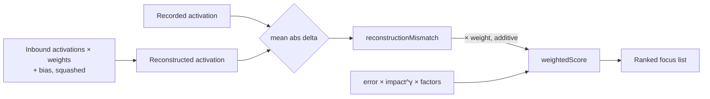

# Focus selection: reconstruction-mismatch signal (Issue #1634)

## Summary

Focus-neuron selection did not use the one signal that directly measures *which
neurons the current model of the creature fails to explain* — the per-neuron
**reconstruction mismatch**. Neurons whose recorded activation cannot be
reconstructed from their inbound synapses (`squash(bias + Σ from_activation ×
weight)`) are exactly where a squash/bias/structural change is most
high-leverage, yet they were not prioritised.

This adds a reconstruction-mismatch focus signal to `src/focus/ranking/`:

- A new `reconstruction` module computes each selectable neuron's **mean
  absolute activation delta** (recorded vs reconstructed) on demand from the
  ranking record provider — no export pass required.
- The delta is folded into the neuron focus score as an **additive** term
  (`+ weight × reconstruction_mismatch`), applied after the multiplicative
  gradient/frequency/history factors, so poorly-reconstructed neurons rise in
  the focus budget without swamping the impact-driven ordering.
- Gated behind an opt-in config flag with a sane, tunable default weight; when
  disabled the score is byte-identical to the pre-#1634 path (`weight = 0` adds
  nothing).

The signal is live on the production FFI path (`rank_focus_neurons`) via the
shared `rank_selectable` core the moment the flag is set, addressing the Issue
#1631 finding that focus/candidate effort was collapsing to near-zero-delta
targets while 1117 neurons missed reconstruction by >0.1 and 386 had a
systematic mean mismatch >0.05.

Closes #1634.

### Configuration (opt-in)

| Env var | Default | Purpose |
|---------|---------|---------|
| `NEAT_AI_DISCOVERY_FOCUS_RECONSTRUCTION_MISMATCH` | `false` | Enable the signal |
| `NEAT_AI_DISCOVERY_FOCUS_RECONSTRUCTION_MISMATCH_WEIGHT` | `0.1` | Additive weight; non-negative finite only, else default |

## Evidence

Backend/CLI change — no web interface to screenshot. Verified via the TDD tests
below (all green) and the full library + integration suite.

Data flow of the new signal:

## Test Plan

TDD — the failing tests were written first, then the implementation made them
pass. The two hidden neurons in the synthetic creature are byte-identical in
everything the legacy focus score sees (records, error, impact, gradient,
frequency) and differ **only in bias**, so their base scores tie exactly and the
new additive signal is isolated.

Integration (`tests/focus/issue_1634_reconstruction_mismatch_focus.rs`):

- `high_mismatch_neuron_ranks_first_when_enabled` — TDD 1: with the signal
  enabled the high-mismatch neuron ranks above the well-reconstructed one; with
  it disabled the two tie on the legacy key and fall back to UUID order (a
  genuine flip).
- `well_reconstructed_neuron_not_boosted` — TDD 2: the well-reconstructed
  neuron's mismatch is ~0 and it is not boosted, while the poorly-reconstructed
  neuron's mismatch is large and outscores it.
- `budget_drops_well_reconstructed_neuron_first` — TDD 3: under a limited focus
  budget the well-reconstructed neuron is dropped and the high-mismatch neuron
  retained.
- `weight_resolver_validates_input` — the pure weight resolver falls back to the
  default for absent/invalid/negative/non-finite input and honours valid
  non-negative values (including zero).

Unit (`src/focus/ranking/reconstruction.rs`):

- `zero_delta_when_reconstruction_matches_recording`
- `nonzero_delta_when_bias_shifts_reconstruction`
- `empty_recording_yields_zero`

Quality gates: `cargo clippy --all-targets --all-features -D warnings`,
`RUSTDOCFLAGS=-D warnings cargo doc`, and `markdownlint-cli2` all pass. The full
`cargo test` suite passes except the pre-existing, timing-sensitive flake
`focus::tests::focus_ranking_aborts_when_budget_exceeded` (a 25 ms-sleep
wall-clock test that also fails on the untouched baseline under machine load —
unrelated to this change).
