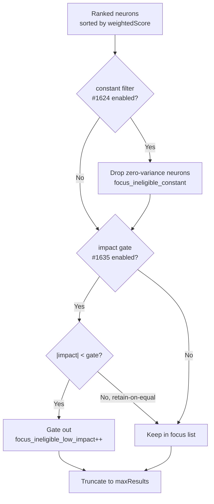

## Summary

Focus selection wasted budget on neurons that cannot move the output. Beyond the
functionally-constant hidden neurons already excluded by #1624, production
snapshot mining (Issue #1631) found a much larger waste class: **31.6%** of
neurons (1303 / 4126) had a structural impact magnitude `|impact| < 1e-6` while
still being **non-constant** (their activation varies across samples), so the
#1624 constant filter leaves them in the focus pool and every slot spent on them
is a wasted candidate evaluation.

This PR adds an **impact-magnitude gate** to focus ranking, complementary to the
constant filter: when enabled, neurons whose structural impact magnitude is
strictly below a configurable threshold (default `1e-6`) are dropped from the
ranked focus list so budget concentrates on neurons that actually influence the
output. The gate is **opt-in**, **never silently drops** (the gated count is
logged and surfaced on `RankFocusStats.focus_ineligible_low_impact`), and leaves
the constant-neuron *removal* path untouched.

`Closes #1635.`

### Behaviour

- New env vars (both default off / `1e-6`):
  - `NEAT_AI_DISCOVERY_FOCUS_IMPACT_GATE` — enable the gate.
  - `NEAT_AI_DISCOVERY_FOCUS_IMPACT_GATE_THRESHOLD` — the gate value; positive
    finite only, invalid/non-positive falls back to the default.
- **Boundary rule — retain-on-equal:** a neuron exactly at the gate is kept;
  only strictly-below (`|impact| < gate`) is dropped. Non-finite impacts are
  treated as below the gate.
- **Fail loud:** when the gate removes neurons it logs
  `focus_ineligible_low_impact` (with the effective gate and remaining focus
  count) and reports the count on `RankFocusStats`; no silent capping.
- **Complementary, not a replacement:** runs *after* the #1624 constant filter
  and removal-candidate identification; the `selectable` set fed to the
  constant-neuron removal path (#306) is unchanged, so a gated neuron remains
  available for bias-fold removal.

### Where the gate sits in the ranking pass

## Evidence

Backend/CLI change — no web interface to screenshot. Verified via the tests
below (all new tests pass; `cargo clippy --all-targets --all-features -D
warnings`, `cargo build --release --lib`, and `RUSTDOCFLAGS=-D warnings cargo
doc` are clean).

TDD proof plan from the issue:

1. **Failing-first** — `low_impact_neurons_gated_when_flag_enabled` builds a
   focus pool with one high-impact and three `|impact| < 1e-6` non-constant
   neurons and asserts the low-impact neurons are gated out while the high-impact
   one is selected. This fails on the pre-change tree (the low-impact neurons
   still consume focus slots).
2. **Boundary** — `impact_gate_tests::below_gate_predicate_boundary_is_retain_on_equal`
   asserts a neuron exactly at the gate is retained and strictly-below is
   dropped.
3. **Diagnostic** — the enabled/disabled tests assert
   `focus_ineligible_low_impact` reports the gated count (3) rather than
   swallowing it, and the disabled baseline proves the low-impact neurons are
   genuinely sub-gate yet non-constant (so only the impact gate — not the
   constant filter — can remove them).

### Pre-existing flaky test (not caused by this change)

`focus::tests::focus_ranking_aborts_when_budget_exceeded` (Issue #1375) is a
wall-clock timing test that asserts an abort within ~1.125s; on this machine it
takes ~1.17s and fails. **It fails identically on the clean base commit** (`git
stash` → same failure at 1.19s), so it is pre-existing timing flakiness under
load, unrelated to the impact gate (which only executes when the opt-in flag is
set and adds a single env check per pass). No production logic was changed to
accommodate it.

## Test Plan

Added `tests/focus/issue_1635_focus_impact_gate.rs` (registered in
`tests/focus/main.rs`):

- `low_impact_neurons_gated_when_flag_enabled` — gate on: the three low-impact
  neurons are dropped, the high-impact neuron remains, count == 3.
- `low_impact_neurons_consume_focus_slot_by_default` — gate off: low-impact
  neurons stay in the pool, count == 0, and their `impact.abs()` is confirmed
  below the `1e-6` default gate while remaining non-constant.
- `custom_threshold_is_honoured` — a gate of `100` (above every normalised
  impact) gates the whole pool; count == 5.
- `resolve_threshold_rejects_invalid_and_non_positive` — pure resolver test:
  missing/empty/non-numeric/zero/negative/`inf`/`NaN` fall back to the default;
  valid positive values (whitespace-tolerant) parse.

Added inline unit tests in `src/focus/ranking/mod.rs`
(`impact_gate_tests`, the gate helpers are module-private):

- `below_gate_predicate_boundary_is_retain_on_equal` — boundary + magnitude +
  non-finite handling of `impact_below_gate`.
- `gate_drops_low_impact_and_keeps_high_impact` — `apply_focus_impact_gate`
  drops sub-gate neurons, keeps the boundary/high ones, returns the count.
- `gate_preserves_order_and_reports_zero_when_all_above` — survivor order is
  preserved and zero is reported when nothing is gated.
