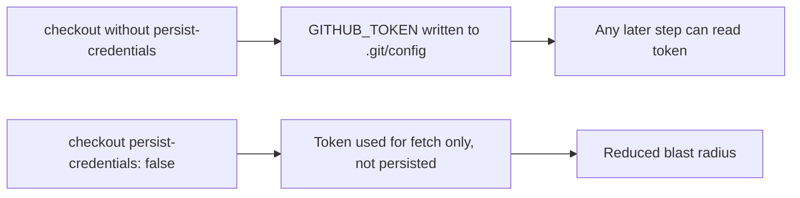

## Summary

The `quality` job in `.github/workflows/ci.yml` ran `actions/checkout` without
`persist-credentials: false`. By default checkout writes the workflow's
`GITHUB_TOKEN` into `.git/config` as an auth header, where any later step in the
job could read it. The `quality` job only fetches, builds, and tests the code —
it never pushes back to the repository nor fetches private submodules — so the
persisted credential is unnecessary and only widens the blast radius of a
compromised step.

This change adds `persist-credentials: false` to that checkout step so the token
is not written to disk. This matches the existing pattern already used by the
`spell-check` job in the same workflow. Closes #1643.

## Evidence

Purely a CI/workflow YAML change — no Rust source, library API, or web interface
is affected, so there is nothing to screenshot. Verification performed:

- Confirmed the `quality` job (checkout → free disk → install Rust → cache →
  fmt/clippy/check/build/test) contains no `git push` or private-submodule
  fetch, so the persisted credential is genuinely unused.
- Validated the edited workflow parses as well-formed YAML
  (`python3 -c "import yaml; yaml.safe_load(open('.github/workflows/ci.yml'))"`
  → `YAML OK`).

## Test Plan

No Rust unit tests apply to a workflow-only change. Verified by:

- YAML well-formedness check on `.github/workflows/ci.yml`.
- Manual review that the `quality` job does not require a persisted credential.
