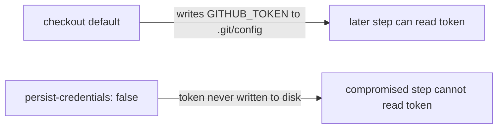

## Summary

Hardened the `validation` job in `.github/workflows/ci.yml` so its
`actions/checkout` step no longer persists the workflow `GITHUB_TOKEN` into
`.git/config`. By default checkout writes the token as an auth header on disk,
where any later step — including a compromised dependency or injected script —
can read it and act as the token. The `validation` job only checks for required
files and validates `Cargo.toml` fields; it never pushes back to the repository
or fetches private submodules, so it does not need the persisted credential.
Adding `persist-credentials: false` narrows the blast radius of a compromised
step. Closes #1644.

This matches the existing hardening already applied to the `quality` and
`spell-check` jobs in the same workflow.

## Evidence

Backend/CI-only change — no web interface to screenshot.

Change applied at the `validation` job checkout step:

```yaml
    - name: Checkout code
      uses: actions/checkout@de0fac2e4500dabe0009e67214ff5f5447ce83dd # v6.0.2
      with:
        persist-credentials: false
```



Verification performed:
- YAML syntax validated with `python3 -c "import yaml; yaml.safe_load(...)"` → `YAML OK`.
- Confirmed the `validation` job has no step that pushes to the repository or
  fetches a private submodule, so the persisted credential is genuinely unused
  (not a false positive).

`quality.sh` covers the Rust toolchain (fmt, clippy, check, test, release
build) and does not lint workflow YAML; this change touches only
`.github/workflows/ci.yml` and has no Rust impact.

## Test Plan

- No unit test framework exists for workflow YAML in this repository; the change
  is a declarative CI configuration edit.
- Validated `.github/workflows/ci.yml` parses as valid YAML.
- Reviewed the full `validation` job to confirm no downstream step requires the
  checkout credential.
