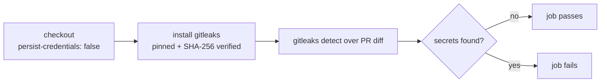

## Summary

Hardened the `gitleaks` GitHub Actions workflow so the `actions/checkout` step no
longer persists the workflow `GITHUB_TOKEN` on disk. By default `actions/checkout`
writes the token into `.git/config` as an auth header, where any later step in the
job — including a compromised dependency or an injected script — can read it and act
as the token. The `gitleaks` job only checks out and scans the PR diff for secrets;
it never pushes back to the repository or fetches a private submodule, so it does not
need the persisted credential. Adding `persist-credentials: false` removes the token
from disk and narrows the blast radius of any compromised step. Closes #1645.

## Change

`.github/workflows/gitleaks.yml` — added `persist-credentials: false` to the
checkout step:

```yaml
      - uses: actions/checkout@de0fac2e4500dabe0009e67214ff5f5447ce83dd # v6.0.2
        with:
          fetch-depth: 0
          persist-credentials: false
```

## Evidence

Backend/CI configuration change — there is no web interface to screenshot, and a
YAML `persist-credentials` key is declarative, so no Rust unit test applies.
Verification performed:

- YAML parses cleanly (`yaml.safe_load` — "YAML OK").
- The `gitleaks` job performs no git write operation: its only steps after checkout
  are installing the pinned gitleaks binary and running `gitleaks detect` over the
  diff. None of these use the persisted checkout credential, so removing it does not
  change behaviour. The CI gitleaks run on this PR is the functional check.



## Test Plan

- Confirmed `.github/workflows/gitleaks.yml` still parses as valid YAML.
- Confirmed no later step in the `gitleaks` job relies on the persisted checkout
  credential (no push, no private submodule fetch).
