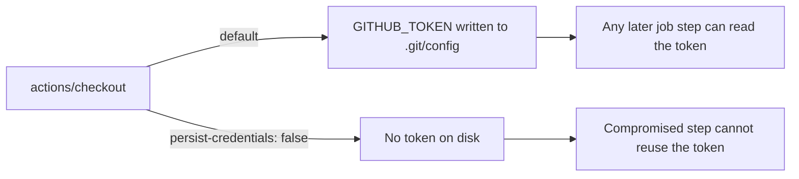

## Summary

Hardened the `markdownlint` job in `.github/workflows/markdown-lint.yml` by
adding `persist-credentials: false` to its `actions/checkout` step. By default
`actions/checkout` writes the workflow's `GITHUB_TOKEN` into `.git/config` as an
auth header, where any later step in the job — including a compromised
dependency or injected script — can read and reuse it. This lint-only job never
pushes back to the repository nor fetches private submodules, so it does not
need the persisted credential; not writing it to disk narrows the blast radius
of a compromised step (defence in depth / least privilege).

The change matches the pattern already applied to sibling workflows
(`ci.yml`, `gitleaks.yml`, `actionlint.yml`, `cargo-quality.yml`).

Closes #1646.

## Evidence

Backend/CI-config change only — no web interface to screenshot.

- `python3 -c "import yaml; yaml.safe_load(...)"` → `YAML OK` (file parses).
- `actionlint .github/workflows/markdown-lint.yml` → `actionlint OK` (no
  workflow-lint errors).
- `grep -rn persist-credentials .github/workflows/` confirms the new setting is
  present and consistent with the other checkout steps in the repo.

Checkout token exposure, before vs after:

## Test Plan

- No Rust code changed, so no unit/integration tests were added — the change is
  confined to a GitHub Actions workflow YAML.
- Validated the workflow with `actionlint` and a YAML parse check (both pass).
- Verified the setting matches the repository-wide convention via
  `grep -rn persist-credentials .github/workflows/`.
