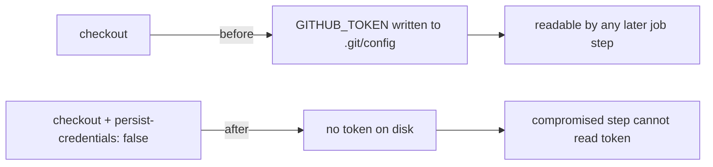

## Summary

Hardened the reusable `security` workflow so the `actions/checkout` step no
longer persists the workflow `GITHUB_TOKEN` into `.git/config`. Added
`persist-credentials: false` to the checkout step in
`.github/workflows/security.yml`. The `security` job only installs and runs
`cargo-audit`, the RustSec audit-check, and the dependency review — it never
pushes back to the repository nor fetches private submodules, so it does not
need the persisted credential. Removing it narrows the blast radius of any
compromised later step in the job (e.g. a poisoned dependency), matching the
existing pattern already used across `ci.yml`, `cargo-quality.yml`,
`gitleaks.yml`, `markdown-lint.yml`, and `actionlint.yml`.

Closes #1647.

## Evidence

Backend/CI-only change — no web interface to screenshot.

Validation performed:

- `actionlint .github/workflows/security.yml` — passes with no findings.
- YAML parse (`yaml.safe_load`) — valid.



Diff applied to the checkout step:

```yaml
      uses: actions/checkout@de0fac2e4500dabe0009e67214ff5f5447ce83dd # v6.0.2
      with:
        # The security job only audits dependencies — it never pushes back
        # to the repository or fetches private submodules. Do not persist the
        # GITHUB_TOKEN in .git/config so a compromised later step cannot read
        # it (Issue #1647).
        persist-credentials: false
```

## Test Plan

- `actionlint` static analysis of the modified workflow (the repo's own
  `actionlint.yml` gate) — passes.
- YAML syntax validation — passes.
- No Rust sources changed, so `cargo`/`quality.sh` behaviour is unaffected.
  Workflow YAML is not covered by the Rust unit-test suite; `actionlint` is the
  relevant automated gate and it is green.
