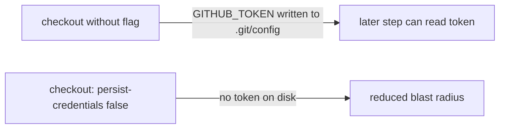

## Summary

The `semgrep` job in `.github/workflows/semgrep.yml` ran `actions/checkout`
without `persist-credentials: false`. By default `actions/checkout` writes the
workflow's `GITHUB_TOKEN` into `.git/config` as an auth header, where any later
step in the job — including a compromised dependency or injected script — can
read it and act as the token. The `semgrep` job only runs a SAST scan over the
tree; it never pushes back to the repository nor fetches a private submodule, so
the persisted credential is unnecessary and only widens the blast radius of a
compromised step.

This PR adds `persist-credentials: false` to the checkout step so the token is
never written to disk. Closes #1648.

## Evidence

Backend/CI change — no web interface to screenshot. Verified via a new Rust test
that reads the workflow YAML and asserts the `semgrep` job's checkout step
disables credential persistence.

## Test Plan

- Added `tests/issue_1648_semgrep_persist_credentials.rs::semgrep_checkout_disables_credential_persistence`,
  which locates the `semgrep` job block in `.github/workflows/semgrep.yml` and
  asserts the checkout step carries `persist-credentials: false`. This test
  fails against the unfixed workflow and passes after the fix.
- `./quality.sh` run clean (fmt, clippy, check, test, release build).
