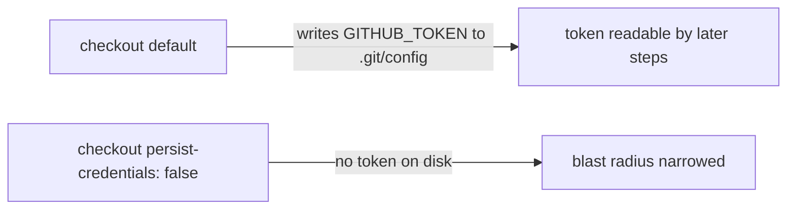

## Summary

Hardened the `shellcheck` job's `actions/checkout` step in
`.github/workflows/shellcheck.yml` by adding `persist-credentials: false`, so
the workflow's `GITHUB_TOKEN` is no longer written to `.git/config` where a
later (potentially compromised) step could read it. The `shellcheck` job only
lints bash scripts over the checked-out tree — it never pushes back to the
repository nor fetches a private submodule — so it does not need the persisted
credential. This matches the hardening already applied to the sibling
`semgrep`, `actionlint`, `gitleaks`, and `security` workflows. Closes #1649.



## Evidence

Backend/CI-only change — no web interface to screenshot. Verified via a new
Rust integration test that reads the workflow YAML and asserts the `shellcheck`
job's checkout step carries `persist-credentials: false`:

```
running 1 test
test shellcheck_checkout_disables_credential_persistence ... ok

test result: ok. 1 passed; 0 failed; 0 ignored; 0 measured; 0 filtered out
```

`cargo fmt --all -- --check` and `cargo clippy --all-targets -- -D warnings`
both pass cleanly.

### Note on quality gate

One unrelated, pre-existing timing test —
`focus::tests::focus_ranking_aborts_when_budget_exceeded` — is flaky under load
(it asserts an abort within a 1.125s wall-clock cap and intermittently overruns
by ~100ms on a saturated machine). It passed on re-run in isolation and is
independent of this YAML-only change, which cannot affect focus-ranking timing.

## Test Plan

- Added `tests/issue_1649_shellcheck_persist_credentials.rs::shellcheck_checkout_disables_credential_persistence`,
  which reads `.github/workflows/shellcheck.yml`, locates the `shellcheck` job
  block, and asserts the checkout step sets `persist-credentials: false`. This
  test fails against the unfixed workflow and passes after the fix.
