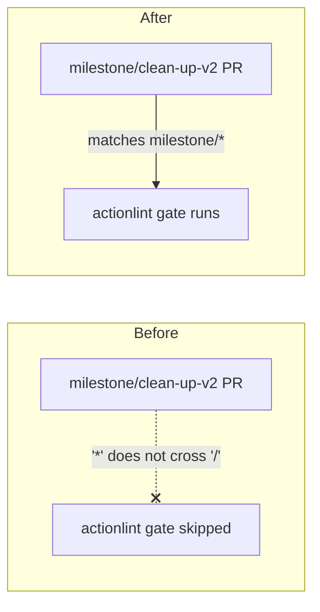

## Summary

The actionlint CI quality workflow (`.github/workflows/actionlint.yml`)
declared a `pull_request: branches: ["*"]` filter. In GitHub Actions branch
filters the `*` glob **does not cross `/`**, so `"*"` matches single-level
branch names (e.g. `Develop`, `main`) but never `milestone/<slug>`. Milestone
sub-issue PRs target a shared `milestone/<name>` branch, so the actionlint gate
never ran on those PRs — workflow regressions merged into the milestone branch
unchecked until the single rollup PR into the default branch caught them.

The fix adds `milestone/*` alongside the existing glob, matching the precedent
already established by `cargo-quality.yml` (Issue #1656):

```yaml
on:
  pull_request:
    branches: ["*", "milestone/*"]
```

The `milestone/*` glob is **additive** — single-level branches stay gated by
`"*"`, and milestone sub-issue PRs are now gated too. Milestone branch names are
`milestone/<slug>` with no nested slashes, so the single-level `milestone/*`
glob is sufficient.

Closes #1650.

## Evidence

Backend/CI change — no web interface to screenshot. Verified via the new Rust
tests below, which parse the workflow YAML as text (no YAML parser is in the
dependency tree, matching the sibling workflow tests) and assert the branch
filter both keeps `"*"` and includes `milestone/*`.



New tests pass:

```
running 2 tests
test actionlint_pull_request_filter_keeps_wildcard ... ok
test actionlint_pull_request_filter_matches_milestone_branches ... ok

test result: ok. 2 passed; 0 failed
```

### Pre-existing flaky test (unrelated)

The full `quality.sh` run flagged one intermittently-failing test,
`focus::tests::focus_ranking_aborts_when_budget_exceeded` (expected abort within
1.125s, observed ~1.15s). It is a timing-sensitive test whose observed duration
hovers at the 12.5% tolerance boundary on a 1s budget; re-running the same
unchanged code passes and fails non-deterministically (1/3 pass on this
machine). It is entirely unrelated to this YAML-only workflow change and is not
introduced by it.

## Test Plan

- Added `tests/issue_1650_actionlint_milestone_filter.rs`:
  - `actionlint_pull_request_filter_matches_milestone_branches` — asserts the
    `pull_request` branch filter includes `milestone/*` (reproduces #1650: fails
    against the unfixed `["*"]` filter, passes after the fix).
  - `actionlint_pull_request_filter_keeps_wildcard` — asserts the additive glob
    keeps the single-level `"*"` so non-milestone PRs stay gated.
