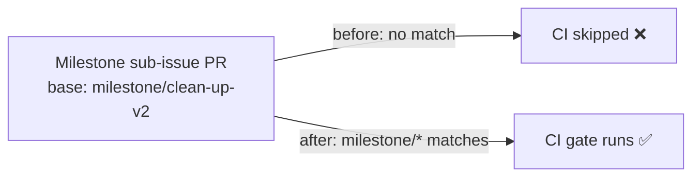

## Summary

The CI quality workflow (`.github/workflows/ci.yml`) gated pull requests with a
`pull_request:` `branches:` filter that listed only `Develop`. In GitHub Actions
branch filters this matches single-level branch names but never
`milestone/<slug>`, so milestone sub-issue PRs — which target a shared
`milestone/<name>` branch under the planning delivery workflow — merged into the
milestone branch **without** the CI gate running. The gap was only caught later
by the single rollup PR into `Develop`, letting every intermediate sub-issue PR
land unchecked.

This PR adds `milestone/*` to the filter so the gate runs on milestone PRs too.
The single-level `milestone/*` glob is sufficient because milestone branch names
are `milestone/<slug>` with no nested slashes. The change is additive — the
existing `Develop` gate is unchanged. Closes #1651.



## Evidence

Backend/CI-config change only — no web interface to screenshot. Verified via the
new Rust integration test, which parses `ci.yml`'s `pull_request:` `branches:`
block sequence and asserts the filter includes `milestone/*` while keeping
`Develop`:

```
running 2 tests
test ci_pull_request_filter_keeps_develop ... ok
test ci_pull_request_filter_matches_milestone_branches ... ok

test result: ok. 2 passed; 0 failed; 0 ignored
```

The test follows the same plain-text parsing approach as the sibling
milestone-filter tests (Issues #1650, #1656), extended to handle `ci.yml`'s YAML
block-sequence form (`- Develop` on its own line) rather than an inline array.

## Test Plan

- Added `tests/issue_1651_ci_milestone_filter.rs`:
  - `ci_pull_request_filter_matches_milestone_branches` — reproduces the gap by
    asserting the `pull_request` branch filter includes `milestone/*`; fails
    against the unfixed workflow and passes after the fix.
  - `ci_pull_request_filter_keeps_develop` — guards that the milestone glob is
    additive and the existing `Develop` gate stays.
- Ran `./quality.sh` (fmt, clippy, check, test, release build) to confirm the
  full gate passes.
