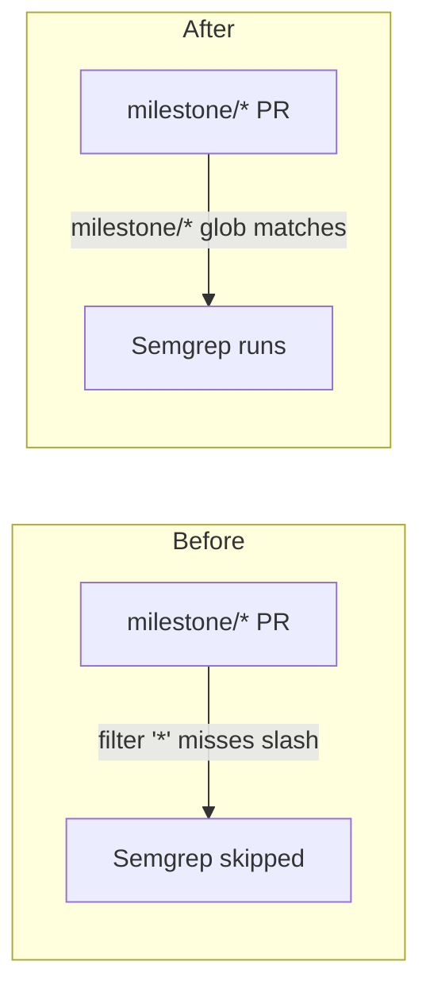

## Summary

The Semgrep CI quality workflow (`.github/workflows/semgrep.yml`) declared a
`pull_request` branch filter of `["*"]`. In GitHub Actions branch filters the
`*` glob does **not** cross `/`, so `"*"` matches single-level branch names
(e.g. `Develop`) but never `milestone/<slug>`. Milestone sub-issue PRs target a
shared `milestone/<name>` branch, so the SAST gate never ran on those PRs and
they merged into the milestone branch unscanned — the gap was only caught later
by the single rollup PR into the default branch.

The fix adds `milestone/*` alongside the existing glob so milestone PRs are
gated too, without changing behaviour for existing single-level branches. This
mirrors the sibling fixes for the actionlint (#1650), CI (#1651), and coverage
(#1656) workflows.

Closes #1654.

## Evidence

Backend/CI-only change — no web interface to screenshot. Verified via the new
plain-text workflow-parsing tests (no YAML parser is in the dependency tree,
matching the sibling workflow tests) plus the full `./quality.sh` gate.



Branch filter, before → after:

```yaml
# before
on:
  pull_request:
    branches: ["*"]

# after
on:
  pull_request:
    branches: ["*", "milestone/*"]
```

## Test Plan

- Added `tests/issue_1654_semgrep_milestone_filter.rs`:
  - `semgrep_pull_request_filter_matches_milestone_branches` — asserts the
    `pull_request` branch filter includes `milestone/*` (fails against the
    unfixed `["*"]` filter, passes after the fix).
  - `semgrep_pull_request_filter_keeps_wildcard` — asserts the single-level
    `"*"` glob is retained so non-milestone PRs stay gated.
- Ran `./quality.sh` (fmt, clippy, check, test, release build) — all pass.
