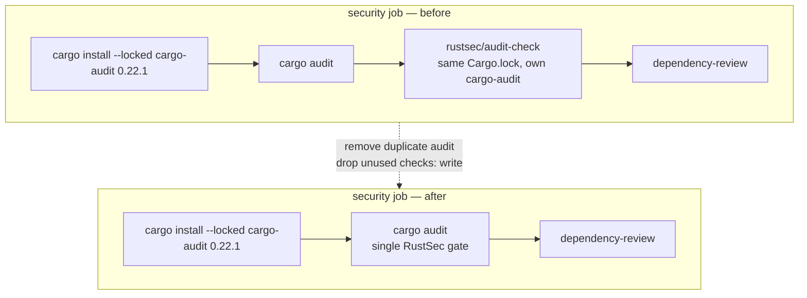

## Summary

The `security` job in `.github/workflows/security.yml` ran the **same** RustSec
advisory audit over the repository's `Cargo.lock` **twice** on every pull
request:

1. An explicit `cargo install --locked --version 0.22.1 cargo-audit` followed by
   `cargo audit` — version-pinned for CVSS 4.0 support (Issue #1223).
2. The `rustsec/audit-check` GitHub Action, which wraps cargo-audit over the
   same lockfile with its **own** bundled cargo-audit version.

Both consult the same advisory database against the same dependency tree in the
same run, so a newly disclosed advisory fails the job at the first `cargo audit`
before the action adds any signal — redundant work, and a drift risk (the
explicit path is pinned for CVSS 4.0 while the action resolves its own version).

**Fix:** keep the version-pinned explicit `cargo audit` path (per the issue's
recommendation — it carries the CVSS 4.0 fix) and remove the duplicate
`rustsec/audit-check` step. With the action gone, the `checks: write` permission
it required has no consumer and is dropped for least privilege in both
`security.yml` and its `ci.yml` caller override. `issues: write` is retained
because `dependency-review-action` posts its PR summary comment through the
Issues API.

Closes #1657.

## Change flow

## Evidence

Backend/CI-config change — no web interface to screenshot. Verified via tests
and the full quality gate:

- `./quality.sh` passes cleanly (fmt, clippy `-D warnings`, check, full test
  suite, doc, release build).
- Red→green confirmed: the new test failed against the unfixed workflow
  (`rustsec/audit-check` present, `checks: write` present) and passes after the
  edit.

## Test Plan

- **Added** `tests/issue_1657_workflow_dedup_audit.rs`:
  - `security_workflow_has_no_rustsec_audit_check` — asserts the duplicate
    action is gone.
  - `security_workflow_keeps_pinned_cargo_audit_path` — asserts the
    version-pinned `cargo install ... cargo-audit` + `cargo audit` gate is
    retained.
  - `security_workflow_drops_unused_checks_write_permission` — asserts
    `checks: write` is dropped and `issues: write` is kept.
- **Modified** `tests/test_security_workflow_validation.sh` (Issue #1122):
  previously *required* `rustsec/audit-check` to be present. Business-logic
  change documented in the file header — the requirement is inverted to assert
  the duplicate action is **absent** (via a new `assert_pattern_absent` helper),
  while still requiring the `cargo audit` / `cargo-audit` patterns.
- **Updated** `SECURITY.md` supply-chain summary to drop the
  `(rustsec/audit-check)` parenthetical.
