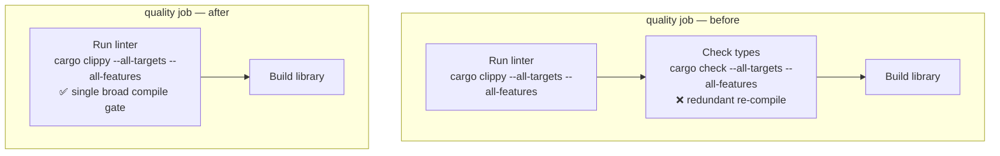

## Summary

Removed the redundant `Check types` step from the `quality` job in
`.github/workflows/ci.yml`. That step ran
`cargo check --all-targets --all-features` immediately after the `Run linter`
step's `cargo clippy --all-targets --all-features`. Clippy is a superset of
`cargo check` — it drives the identical compilation over the same
`--all-targets --all-features` scope under the same `RUSTFLAGS: "-D warnings"`
job environment — so `Check types` could never fail unless the clippy step
before it had already failed. It added a full re-check pass to the heaviest job
(45-minute cap) for zero additional signal.

The clippy `Run linter` step now stands as the single broad compile gate. The
cross-reference comment in the `validation` job — which previously cited
"the `quality` job (Check types)" — was repointed at the surviving
"Run linter" step so the reference stays accurate.

Closes #1658.

## Change detail

- `.github/workflows/ci.yml` — deleted the `Check types` step; repointed the
  `validation` job comment from `Check types` to `Run linter`.

## Evidence

Backend/CI-only change — no web interface to screenshot. Verified via the
plain-text workflow-parsing tests plus the full `./quality.sh` gate.

`./quality.sh` output (tail): `✅ All quality checks passed!` — 171 lib/integration
tests plus the vectorisation audit all pass.

## Test Plan

- Added `tests/issue_1658_remove_redundant_cargo_check.rs`:
  - `no_standalone_check_types_step` — asserts the `Check types` step is gone.
  - `quality_job_has_no_redundant_cargo_check` — asserts no
    `cargo check --all-targets --all-features` remains in `ci.yml`.
  - `linter_step_is_the_broad_compile_gate` — asserts clippy remains the broad
    compile gate.
  - `validation_comment_points_at_surviving_step` — asserts the `validation`
    comment references `Run linter`, not `Check types`.
- Updated `tests/issue_1342_workflow_dedup_cargo_check.rs`: the
  `check_types_step_retains_broad_compile_gate` test asserted the now-removed
  step existed, so it was updated (renamed to
  `linter_step_retains_broad_compile_gate`) to assert the clippy `Run linter`
  step is the surviving compile gate. Doc comments and the sibling assertion
  message were repointed at `Run linter`. This modification is a direct
  consequence of the business-logic change in #1658 (the `Check types` step no
  longer exists).
