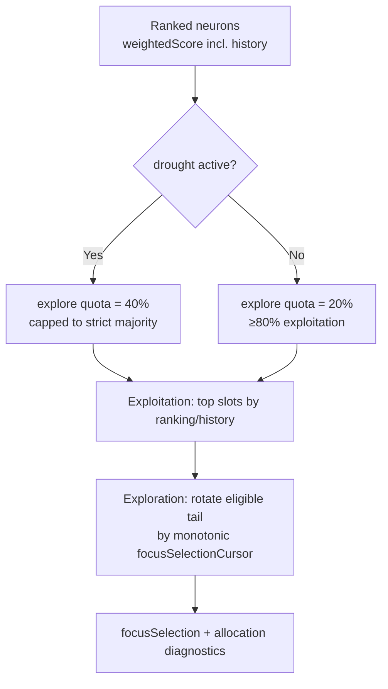

## Summary

Replaces Issue #1445's full-list **stratification** (and top-`K × N` drought
rotation) in `select_focus_neurons` with a deterministic **exploit/explore**
allocation that exploits the impact/history ranking while still guaranteeing
eventual full coverage of every eligible neuron. This restores expensive
analysis budget to the likely-success neurons #1445 flattened away, which is the
suspected cause of the production candidate-rate drop after #1445. Closes #1662.

Behaviour now:

- **Exploitation majority** — most focus slots take the highest-ranked,
  highest-weight neurons (default ≥80% outside drought, always a strict
  majority). The ranking weight retains its Bayesian success-history multiplier.
- **Bounded exploration quota** — the remaining slots (default 20%, at least one
  when the set has capacity) rotate deterministically through the complete
  eligible tail of the ranked list.
- **Eventual full coverage** — exploration is seeded by a new monotonic
  per-creature `focusSelectionCursor` that the host advances every pass and
  **never resets on candidate success**, so every eligible neuron is selected
  within a finite number of passes.
- **Drought stays exploitative** — drought widens the exploration quota
  (`DROUGHT_EXPLORATION_FRACTION` = 0.4 vs `DEFAULT_EXPLORATION_FRACTION` = 0.2)
  but exploitation always keeps a strict >50% majority.
- **Deterministic** — identical ranked input + cursor produces identical output;
  no random selection.
- **Allocation diagnostics** — the FFI `focusSelection` block now reports
  `exploitationCount`, `explorationCount`, `explorationCursor`,
  `eligiblePoolSize`, `cumulativeCoverage` and `droughtActive`.

Proven-ineligible gates (input / constant / demonstrably zero-impact neurons)
are untouched — they are excluded upstream by ranking before selection sees the
pool, so "all neurons" means every eligible candidate-producing neuron.

### Files changed

- `src/focus/selection.rs` — exploit/explore allocator, new `FocusSelection`
  fields, unit tests (rewrites the #1445 stratification/rotation tests per the
  issue's TDD proof 7).
- `src/focus/mod.rs` — re-export the new exploration-fraction constants (drop
  `DROUGHT_ROTATION_POOL_FACTOR`).
- `src/ffi_types/requests.rs` — new optional `focusSelectionCursor` input.
- `src/ffi_types/responses/mod.rs` — `FocusSelectionJson` allocation diagnostics.
- `src/ffi_internal/analysis.rs` — thread the monotonic cursor and emit the new
  diagnostics in the WARN.
- `tests/ffi/issue_1445_focus_selection_diversity.rs` — updated to the new FFI
  contract.
- `docs/FOCUS_SELECTION.md` — documents the new allocation and updated diagram.

## Evidence

Backend/library change — no web UI to screenshot. Verified by unit and FFI
integration tests (`cargo test`) and `cargo clippy -D warnings`.

### Test Plan

Issue's TDD proofs (in `src/focus/selection.rs`):

- `exploitation_majority_retains_ranked_head` — 100 descending candidates, N=10 →
  ≥8 exploitation slots and the highest-ranked candidate retained (proof 1).
- `exploration_reaches_full_coverage` — N=10, 2 exploration slots, 50 monotonic
  cursors cover all 100 eligible candidates with the exploitation majority each
  pass (proof 2).
- `cursor_survives_success` — advancing the cursor after a simulated success
  continues exploration rather than restarting at rank 0 (proof 3).
- `drought_widens_exploration_but_keeps_majority` — drought raises exploration
  but keeps a strict exploitation majority (proof 4).
- `success_history_orders_into_exploitation` — higher success-history weight
  lands inside the exploitation head, lower falls outside (proof 5).
- `no_duplicate_slots_across_passes` — no neuron takes two slots in a pass
  (proof 6).
- Plus `deterministic_for_same_inputs`, `allocation_diagnostics_are_reported`,
  and updated edge-case tests.

FFI (`tests/ffi/issue_1445_focus_selection_diversity.rs`):

- `focus_selection_is_surfaced_with_concentration_metrics` — rewritten to assert
  the allocation diagnostics and strict exploitation majority (proof 7 replaces
  the `diversityFloorApplied` assertion).
- `drought_widens_exploration_and_advances_cursor` — replaces the top-`K × N`
  rotation test.
- `rank_focus_input_focus_selection_cursor_round_trips` — the new cursor field
  deserialises and defaults to `None`.

### Known issue (unrelated, pre-existing)

`focus::tests::focus_ranking_aborts_when_budget_exceeded` is a timing assertion
(1.125s ceiling where the fixed abort grace alone is 1.0s). It passes in
isolation on both this branch and the base branch, and only slips (~1.13–1.17s)
under the oversubscribed full `cargo test` run. It exercises the ranking
budget-abort path, which this change does not touch, so the flake is pre-existing
and environmental, not a regression from #1662.
