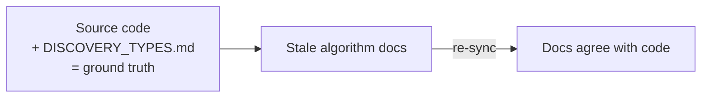

# PR Summary — Issue #1680

## Summary

Re-synced five algorithm docs to the current implementation. They described
detection thresholds and behaviour the code no longer implements, actively
misleading any agent reasoning about detection behaviour. `docs/DISCOVERY_TYPES.md`
and the cited source files were treated as the authoritative ground truth. **Closes #1680.**

The following contradictions were corrected:

1. **Saturation thresholds** (`docs/ANALYSIS_DEEP_DIVE.md`, `docs/discoveries/saturated-neuron.md`)
   — updated to the Issue #417 values: TANH `|mean| > 0.85` (was `0.95`),
   LOGISTIC `> 0.90 / < 0.10` (was `0.95 / 0.05`), HARD_TANH `> 0.95` (was
   `0.99`), max std dev `0.08` (was `0.05`). Matches
   `src/analysis/detection/saturation.rs`.
2. **Oscillation thresholds** (`docs/ANALYSIS_DEEP_DIVE.md`, `docs/discoveries/oscillating-neuron.md`)
   — updated to sign-change fraction `≥ 0.15` (was `0.3`) and minority sign
   `≥ 10%` (was `20%`), incl. the flowchart, threshold table and worked example.
   Matches `src/analysis/detection/oscillating_neuron.rs`.
3. **Dormant-synapse criterion** (`docs/ANALYSIS_DEEP_DIVE.md`, `docs/discoveries/dormant-synapse.md`)
   — rewritten from weight-first (`|weight| < 1e-4`) to the Issue #1632
   contribution-first flow: mean `|weight × source_activation| < 1e-4` with a
   single-observation spike guard (`max |contribution| > 7.5e-5` ⇒ not dormant).
   Matches `src/analysis/detection/dormant_synapse.rs`.
4. **Threshold-squash impact normalisation** (`docs/IMPACT_CALCULATION.md`) —
   removed the self-contradiction: the "don't normalise by total_inbound"
   rule (`contribution = child_impact`) in the Impact Model table, the
   category formulas and the appendix now follow the Issue #1300 normalised +
   emit-magnitude-capped formula (`|w|/T × child_impact`), agreeing with the
   file's own #1300 note and `src/focus/impact.rs`.
5. **MH acceptance** (`docs/CANDIDATE_PIPELINE_MCMC_AUDIT.md`) — added a dated
   postscript (and a top banner) noting that Issue #1018 later introduced opt-in
   Metropolis-Hastings acceptance (gated on `NEAT_AI_DISCOVERY_MH_TEMPERATURE`,
   `src/analysis/synapse/target_analysis/evaluation.rs`), so the audit's negative
   recommendation is preserved as history rather than read as current fact.

## Evidence

Documentation-only change — no code, no web interface to screenshot. The updated
numbers were verified directly against the cited source files:

| Doc claim (after) | Source constant | File |
|---|---|---|
| TANH `0.85`, LOGISTIC `0.90/0.10`, HARD_TANH `0.95`, std dev `0.08` | `TANH_SATURATION_THRESHOLD` etc. | `src/analysis/detection/saturation.rs` |
| Sign-change `0.15`, minority `0.1` | `MIN_SIGN_CHANGE_FRACTION`, `MIN_MINORITY_SIGN_FRACTION` | `src/analysis/detection/oscillating_neuron.rs` |
| Contribution-first, spike guard `7.5e-5`, mean `1e-4` | `DORMANT_CONTRIBUTION_THRESHOLD`, `DORMANT_MAX_CONTRIBUTION_THRESHOLD` | `src/analysis/detection/dormant_synapse.rs` |
| Threshold squash normalised + emit cap | `SquashCategory::Threshold` branch | `src/focus/impact.rs:718-742` |
| Opt-in MH acceptance, env-gated | `mh_temperature()` gate | `src/analysis/synapse/target_analysis/evaluation.rs:387-408` |

Validation run:
- `codespell` on all six changed docs — clean.
- `markdownlint-cli2` across the repo — `0 error(s)`.

## Test Plan

No automated tests — this is a documentation correction with no behavioural
change. Verification was by direct comparison of each doc value against the
authoritative source constant (table above), plus `codespell` and
`markdownlint-cli2` passing on the changed files.
