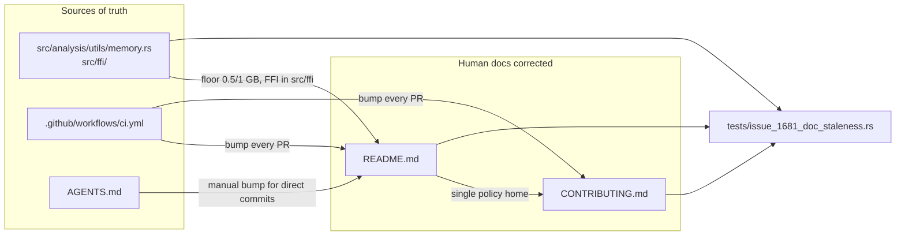

# PR Summary — Issue #1681

## Summary

`README.md` (the declared human source of truth) and `CONTRIBUTING.md` carried
factual errors, an internal contradiction, and a three-way version-bump-policy
contradiction with `AGENTS.md`. This PR corrects the stale facts and reconciles
the version-bump policy against the actual code and `.github/workflows/ci.yml`.
Documentation-only change — no library behaviour changes. Closes #1681.

### Fixes

1. **FFI symbol location.** The FFI summary claimed the authoritative export list
   lives in `src/lib.rs` as `#[no_mangle] pub extern "C"` functions. The symbols
   actually live under `src/ffi/` (`mod.rs`, `analysis.rs`, `gpu.rs`,
   `recording.rs`, `utilities.rs`) with the `#[unsafe(no_mangle)]` attribute.
   README now points there with the correct spelling (matching `AGENTS.md`).
2. **Available-RAM floor.** The Minimum System Requirements table said
   "Available RAM | 1 GB", contradicting `README` troubleshooting and the code
   (`src/analysis/utils/memory.rs`: 0.5 GB macOS / 1.0 GB Linux). The row now
   reads "0.5 GB (macOS) / 1 GB (Linux)".
3. **Version-bump trigger + policy (three-way contradiction).**
   - `ci.yml`'s `version-increment` job runs on **every** pull request (unless a
     bump already exists on the branch) — there is no `src/`-change detection.
     README and CONTRIBUTING now state the real trigger, matching `AGENTS.md`.
   - The flat "do not manually bump" statements contradicted `AGENTS.md`, which
     requires a manual patch bump for **direct commits** (where CI does not run).
     Both human docs now carry the direct-commit caveat and name the README
     "Distributed Build & Versioning" section as the single authoritative policy;
     CONTRIBUTING links to it. This removes the contradiction without inventing a
     new policy — it harmonises the docs to the observed CI behaviour and the
     existing `AGENTS.md` rule.
4. **Deno permissions example.** The `deno run` example omitted `--allow-write`
   even though the library writes Parquet files. Added `--allow-write`.
5. **Mission wording.** The related-repositories row described this repo as
   searching "architectures and hyper-parameters" — nothing here does
   hyper-parameter search. Reworded to "propose structural/bias/weight/squash
   mutation candidates", matching the README introduction.

## Evidence

Documentation/CLI-only change — no web interface to screenshot. Verified by a new
test file that ties the docs to the code and to `ci.yml` (`include_str!` pattern,
matching the repo's existing documentation-accuracy tests such as
`tests/issue_1684_doc_dedup.rs` and `tests/issue_1612_agents_readme_anchors.rs`).

## Test Plan

Added `tests/issue_1681_doc_staleness.rs` (8 tests) which fail against the stale
docs and pass after the fix:

- `readme_points_ffi_symbols_at_src_ffi_not_lib_rs` — README points at `src/ffi/`
  with `#[unsafe(no_mangle)]`, not `src/lib.rs`.
- `code_confirms_ffi_symbols_live_under_src_ffi` — `src/lib.rs` has no
  `no_mangle`; `src/ffi/analysis.rs` does (ties doc claim to code).
- `readme_available_ram_row_states_per_platform_floor` — row states the
  per-platform floor; the bare "1 GB" row is gone.
- `documented_floor_matches_code_constant_on_this_platform` — the documented
  floor matches `DEFAULT_MIN_AVAILABLE_MEMORY_GB` for the build platform.
- `version_bump_docs_describe_every_pr_not_src_detection` — README and
  CONTRIBUTING state the every-PR trigger, not `src/`-change detection.
- `manual_bump_policy_is_consistent_across_docs` — flat prohibitions removed;
  direct-commit caveat present, reconciled with `AGENTS.md`.
- `readme_deno_example_grants_allow_write` — the Deno example grants
  `--allow-write`.
- `readme_related_repo_role_describes_mutation_candidates` — no hyper-parameter
  search wording; describes mutation candidates.

Existing `tests/issue_1684_doc_dedup.rs` (14 tests) and
`tests/issue_1612_agents_readme_anchors.rs` continue to pass. Full `./quality.sh`
was run before committing.
