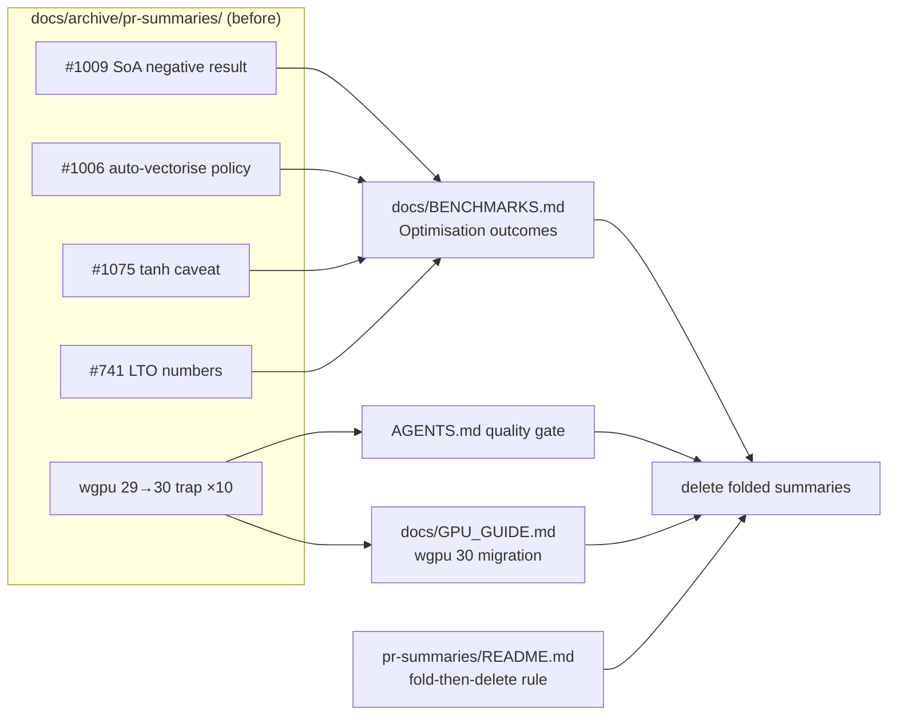

# PR Summary — Issue #1682

## Summary

The PR-summary archive (`docs/archive/pr-summaries/`) held durable learnings —
including first-class **negative results** — that were reflected nowhere in the
live docs, and the folding/retention rule itself was uncodified. An agent asked
to "optimise the hot loops" today would re-attempt approaches already proven
fruitless, and the wgpu 29→30 upgrade trap had been independently rediscovered
in ~ten PRs.

This PR folds those learnings into the live docs, then deletes the folded
summaries, and codifies the fold-then-delete retention rule. **Closes #1682.**

- **Theme A — SIMD / vectorisation (→ `docs/BENCHMARKS.md`).** New
  "🧪 Optimisation outcomes" section records: the #1006 auto-vectorisation-first
  policy; the #1009 **negative result** that Struct-of-Arrays layout and compiler
  hints (`#[inline(always)]`, `target-cpu=native`, `#[target_feature]`) give no
  meaningful improvement because the blockers are `is_finite()` branches and
  function-pointer calls, not data layout ("no code changes warranted"); and the
  #1075 caveat that branch elimination helps value-domain paths (30–34 %) but is
  within noise on `tanh`-dominated paths.
- **Theme B — the `cargo upgrade --incompatible` breaking-major-bump trap
  (→ `AGENTS.md` quality gate + `docs/GPU_GUIDE.md`).** The wgpu/naga 29→30 bump
  broke `src/analysis/gpu/*` (`get_mapped_range()` → `Result<BufferView,
  MapRangeError>`, new `RequestAdapterOptions::apply_limit_buckets`) and was
  reverted in ~ten PRs before the migration landed (#1594). The migration is now
  **complete**, so the docs record the resolved API breakages and the
  migrate-or-revert rule rather than a stale "pending" note.
- **Theme C — release-profile LTO (→ `docs/BENCHMARKS.md`).** The #741 numbers:
  `lto = "fat"` + `codegen-units = 1` measured −56 % / −22 % / −8 % pipeline
  runtime (small→large creatures) for a 12 s → 3 m 07 s release-compile cost.
- **Meta — retention rule (→ `docs/archive/pr-summaries/README.md`).** Summaries
  are retained only until their durable learnings are folded into the live docs,
  then deleted; **no negative result may be dropped**, and capture is the
  precondition for deletion.

The 14 folded summaries (`1006, 1009, 1075, 741, 1482, 1484, 1485, 1517, 1518,
1519, 1521, 1532, 1544, 1566`) were deleted **after** their learnings landed in
the live docs. `pr-summary-1594.md` (the wgpu 30 migration record and source of
the folded GPU learning) is retained.

## Evidence

Documentation + test-only change — no web interface to screenshot. Verified via
the new regression test and the full quality gate (`./quality.sh` — fmt, clippy
`-D warnings`, check, tests, doc build, release build all clean) and
`markdownlint-cli2` (0 errors).

## Test Plan

Added `tests/issue_1682_pr_summary_folding.rs` (9 tests, all passing):

- `benchmarks_has_optimisation_outcomes_section`,
  `benchmarks_records_soa_negative_result`,
  `benchmarks_records_auto_vectorisation_first_policy`,
  `benchmarks_records_tanh_path_caveat` — Theme A landed in `BENCHMARKS.md`.
- `benchmarks_records_lto_tradeoff` — Theme C numbers landed in `BENCHMARKS.md`.
- `agents_quality_gate_warns_about_incompatible_major_bumps`,
  `gpu_guide_records_wgpu_30_migration` — Theme B landed in `AGENTS.md` /
  `GPU_GUIDE.md`.
- `archive_readme_codifies_fold_then_delete_rule` — retention rule codified,
  blanket indefinite-retention promise removed.
- `folded_summaries_were_deleted_after_capture` — the 14 folded summaries are
  gone and `pr-summary-1594.md` is retained (capture-before-delete invariant).

No existing tests were modified or removed. Adjacent doc-audit suites
(`issue_1684_doc_dedup`, `issue_1612_agents_readme_anchors`,
`issue_1681_doc_staleness`) still pass.
