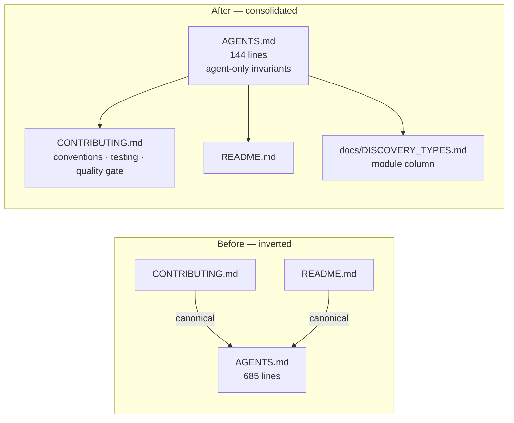

# PR Summary — Issue #1683

## Summary

`AGENTS.md` had grown into a 685-line parallel content store whose largest
section — a hand-maintained mirror of the source tree — had materially drifted
(it listed a phantom `src/analysis/cache/shared_records.rs`, missed ~35 real
files, and carried stale `tests/`/`benches/` counts). Worse, the human docs
deferred *into* `AGENTS.md` as canonical for the quality gate, coding
conventions, testing philosophy and architecture — the inverse of the intended
hierarchy. This change **consolidates** the shared material into the human docs
and reduces `AGENTS.md` to a thin (144-line) agent-only pointer file.

What changed:

1. **Deleted the drift-prone source-tree mirror** (old §2). `AGENTS.md` now
   points at `src/` and the module column of `docs/DISCOVERY_TYPES.md` instead of
   re-listing the filesystem.
2. **Moved the canonical content into `CONTRIBUTING.md`** and flipped the four
   inbound pointers (`CONTRIBUTING.md` no longer links to
   `AGENTS.md#2-architecture`, `#3-coding-conventions`, `#4-testing-philosophy`,
   `#5-quality-gate`):
   - **Code Style** now carries the Australian-English rules, coding principles
     and Rust best practices.
   - **Testing Guidelines** now carry the "what" vs "how" doctrine and the
     unit-tests-vs-benchmarks guidance.
   - **Quality Gate** now lists the *real* `quality.sh` steps — including the
     previously-omitted **shellcheck** and **`./scripts/check-pr-summary-location.sh`**
     steps — and documents the CI trigger on `Develop` **and** `milestone/*`
     (Issue #1651), both of which the stale list got wrong.
   - **Project Structure** points at `src/` and `docs/DISCOVERY_TYPES.md` rather
     than a hand-written tree.
3. **Dropped the duplicated blocks** from `AGENTS.md`: the triplicated
   `runlib.sh` description, the candidate-type table (README /
   `docs/DISCOVERY_TYPES.md` own it), and the quick-reference command list.
4. **Kept the agent-only material** in `AGENTS.md`: the §9 Key Invariants
   (forward-only order, the `validate_forward_only_synapses` FFI table, atomic
   record writes, VALUE domain errors), the FFI memory-free invariant, and the
   do-not-modify-`ci.yml` rule.
5. **Fixed the broken emoji anchors.** README's headings carry emoji, so
   `README.md#gpu-requirement` and `README.md#additional-documentation` never
   resolved. They are retargeted to the emoji-free `README.md#minimum-system-requirements`
   heading (unambiguous on GitHub) and plain file links, so no broken fragment
   remains. `README.md` was updated so its "For AI agents" pointer sends
   conventions to `CONTRIBUTING.md` and invariants to `AGENTS.md`.

This mirrors the repo's own single-source precedent for env vars
(`docs/CONFIGURATION.md`, Issue #1611).

Closes #1683.

### Pointer architecture — before vs after



## Evidence

Docs/CLI change — no web UI to screenshot. Verified by the doc-integrity test
suite, which ties the prose to the code (`quality.sh`, `ci.yml`) so it cannot
drift again:

```
tests/issue_1683_agents_consolidation.rs .... 11 passed
tests/issue_1612_agents_readme_anchors.rs ....  3 passed
tests/infrastructure::issue_1612_agents_readme_anchors ....  4 passed
tests/issue_1611_env_var_single_source.rs ....  8 passed
tests/issue_1681_doc_staleness.rs ....  8 passed
tests/issue_1684_doc_dedup.rs .... 14 passed
```

`cargo fmt --all`, `cargo clippy --test issue_1683_agents_consolidation -- -D
warnings`, the bash-syntax check, `shellcheck`, and
`./scripts/check-pr-summary-location.sh` all pass.

## Test Plan

- **Added** `tests/issue_1683_agents_consolidation.rs` (11 tests):
  - the drifted source-tree mirror and stale counts are gone;
  - `AGENTS.md` is thin (< 200 lines) and points at the human docs;
  - `CONTRIBUTING.md` no longer defers to `AGENTS.md` and now owns the coding
    conventions and testing doctrine;
  - the quality-gate description matches `quality.sh` (shellcheck +
    PR-summary-location) and the CI trigger matches `ci.yml` (`milestone/*`);
  - the agent-only invariants (`validate_forward_only_synapses`,
    `free_discovery_result`, the `ci.yml` rule) are preserved;
  - the duplicated blocks and broken emoji anchors are gone.
- **Regression-guarded** the existing doc suites (`issue_1611`, `issue_1612`
  root + infrastructure, `issue_1681`, `issue_1684`) all still pass, confirming
  the consolidation keeps every single-source and anchor-integrity invariant.
