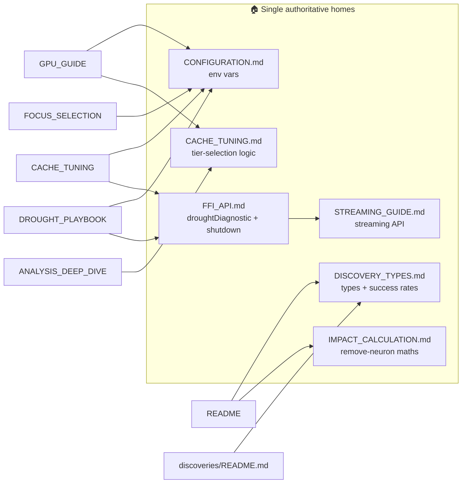

# PR Summary — Issue #1684

## Summary

Deduplicated drifting copies across the documentation set so each topic has
**one authoritative home** and every other file links to it, honouring the
repo's own single-source rule (`docs/CONFIGURATION.md`, `CONTRIBUTING.md`).
Several copies had already drifted; consolidating removes the drift seeds.
Closes #1684.

**README dedup**

- Replaced the five discovery-type tables (~44 rows that had drifted from the
  authoritative doc — missing "Remove Harmful Synapse" / "Remove Neuron (Error)"
  and a renamed "Combo Successful") with concise category one-liners plus a link
  to the [Discovery Type Summary](../../DISCOVERY_TYPES.md#discovery-type-summary).
- Dropped the seven-row cost-function table in favour of the existing
  `docs/COST_FUNCTION_NOTES.md` link (which carries the richer per-consumer audit).
- Moved the remove-neuron weight-redistribution compensation maths (Δw formula,
  residual variance, `ActivationCovariance`) into `docs/IMPACT_CALCULATION.md`
  and left a three-line README summary + link. `docs/IMPACT_CALCULATION.md` is
  now the live home (previously the detail lived only in an archived PR summary).

**Environment variables — single source completed**

- Folded the ~24 previously-undocumented runtime knobs (e.g.
  `TARGET_COOLDOWN_FAILURES`, `CONSERVATIVE_GAIN_MULTIPLIER`,
  `FOCUS_RECONSTRUCTION_MISMATCH`, `GPU_RETRY_LIMIT`, `NOISE_SIGNAL_THRESHOLD`,
  `COORDINATED_NOISE_FLOOR_MULTIPLIER`) into `docs/CONFIGURATION.md`, and added
  the #3172 lazy-mode budget scaling to the `FOCUS_RANKING_BUDGET_MS` row.
- Reduced the parallel env-var tables in `CACHE_TUNING.md`, `GPU_GUIDE.md`,
  `DROUGHT_PLAYBOOK.md`, and `FOCUS_SELECTION.md` to links. `DROUGHT_PLAYBOOK.md`
  keeps its unique operator "when to change" levers but drops the duplicated
  default/range columns.

**Cross-doc duplicates — one home each**

| Topic | Home | Now links |
|-------|------|-----------|
| Streaming API reference | `STREAMING_GUIDE.md` | `FFI_API.md` (kept the FFI-symbol table) |
| `droughtDiagnostic` schema | `FFI_API.md` (completed with the missing fields) | `DROUGHT_PLAYBOOK.md` |
| Cache tier-selection logic | `CACHE_TUNING.md` | `ANALYSIS_DEEP_DIVE.md`, `GPU_GUIDE.md` |
| Recommended shutdown sequence | `FFI_API.md` | `CACHE_TUNING.md` |
| Production success rates | `DISCOVERY_TYPES.md` | `docs/discoveries/README.md` |

## Evidence

Documentation-only change (plus one regression test) — no web UI to screenshot.
Verified via:

- **New regression test** `tests/issue_1684_doc_dedup.rs` (14 tests) locks in
  the consolidation and guards against re-drift — asserts each topic's home
  documents the material, each linker points at it, and the removed duplicate
  tables/snippets are gone.
- Existing doc guards still pass: `issue_1611_env_var_single_source` (8),
  `issue_1506_ffi_doc_coverage` (5), `issue_1612_agents_readme_anchors` (3),
  `doc_cache_tuning_examples` (8).
- `cargo clippy --all-targets --all-features -- -D warnings`, `cargo fmt --check`,
  and `RUSTDOCFLAGS="-D warnings" cargo doc --no-deps` are clean.
- `markdownlint-cli2@0.23.0` reports 0 errors across the doc set.
- Confirmed every `NEAT_AI_DISCOVERY_*` variable read in `src/` (except the two
  `TEST_PLATFORM_*` test-harness knobs) is now documented in
  `docs/CONFIGURATION.md`.

## Test Plan

- `tests/issue_1684_doc_dedup.rs`
  - `readme_replaces_discovery_tables_with_a_single_link`
  - `readme_drops_the_cost_function_table_and_keeps_the_link`
  - `remove_neuron_maths_lives_in_impact_calculation_not_only_the_readme`
  - `configuration_documents_the_previously_undocumented_runtime_knobs`
  - `configuration_folds_in_the_lazy_budget_scaling_note`
  - `every_variable_named_in_reduced_docs_is_in_the_canonical_reference`
  - `cache_tuning_env_table_is_reduced_to_a_link`,
    `gpu_guide_streaming_block_is_reduced_to_a_link`,
    `focus_selection_env_table_is_reduced_to_a_link`
  - `cache_tier_logic_has_one_home_and_the_others_link_to_it`
  - `shutdown_sequence_home_is_ffi_api`
  - `drought_diagnostic_schema_home_is_ffi_api`
  - `streaming_api_reference_home_is_streaming_guide`
  - `production_success_rates_home_is_discovery_types`
- Re-ran the existing documentation guard tests listed under Evidence — all pass.
