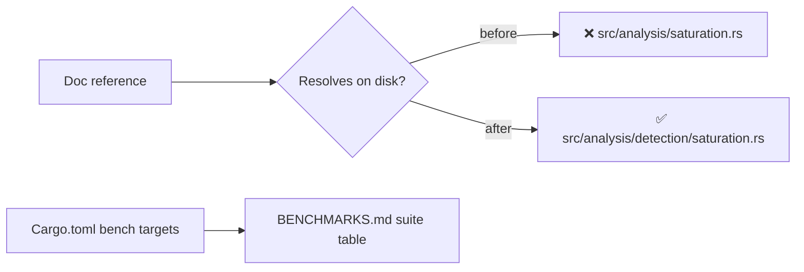

# PR Summary — Issue #1685

## Summary

Repointed a batch of stale pre-refactor paths and broken internal links across
the docs so every reference resolves against the current source tree (which now
lives under `src/analysis/detection/`, `src/analysis/recommendation/`,
`src/analysis/neuron/`, `src/analysis/synapse/` and `src/focus/`). This is a
mechanical doc-only re-sync — no runtime code changed. **Closes #1685.**

Changes:

- **`docs/discoveries/` (13 files)** — repointed each `**Source:**` link from the
  old flat path to its real module:
  `neuron.rs`/`synapse.rs` → `neuron/` / `synapse/`; the rest into
  `detection/` or `recommendation/`. Fixed the `weight-polarity-flip.md` test
  link (`tests/issue_644_weight_polarity_flip.rs` →
  `tests/detection/issue_644_weight_polarity_flip.rs`).
- **`docs/DISCOVERY_TYPES.md`** — repointed the 19 stale `**Source**:` detail-section
  lines (including the removed `implementation.rs` → `synapse/` and `focus.rs` →
  `focus/`) to the paths the summary tables already carried; corrected the
  `Squash + Weight Rescale` anchor to the GitHub double-hyphen slug
  `#squash--weight-rescale-detection` in the ToC and summary table.
- **`docs/IMPACT_CALCULATION.md`** — updated the "Related Code" table from the
  directories-as-files `src/focus.rs` / `src/analysis.rs` / `tests/focus.rs` to
  `src/focus/impact.rs`, `src/focus/ranking/mod.rs`, and `tests/focus/`.
- **`docs/discoveries/README.md`** — added the five missing scenario-index rows
  (`hard-sample-cluster`, `monotonicity`, `output-conflict`,
  `output-range-compression`, `weight-polarity-flip`).
- **`docs/BENCHMARKS.md`** — regenerated the suite table from `Cargo.toml`
  (dropped the unregistered `impact_cache_contention`, added the 14 undocumented
  suites) so it lists exactly the 42 registered `[[bench]]` targets, and fixed
  the "28" count to "42" in both places.
- **`docs/ci-doc-build-step.md`** — marked the proposed `cargo doc` CI step as a
  **pending, unimplemented** proposal (no workflow builds docs today —
  `ci.yml:362-379` only greps for `///`); corrected the stale `quality.sh` line
  pointer (`line 41` → `quality.sh:74-75`) and documented the `--all-features`
  flag mismatch between `quality.sh`, `scripts/doc-check.sh`, and the proposal.

### Already resolved (no change needed)

Two items in the issue had already been fixed by Issue #1684's doc-dedup work and
are verified still correct: `docs/FOCUS_SELECTION.md` now points at
`docs/CONFIGURATION.md § Focus selection & ranking` (no README env-var table
reference), and `README.md` no longer carries the broken
`#squash-weight-rescale-detection` link.

## Evidence

Backend/docs change — no web UI to screenshot. Verification is by a new
integration test that ties the docs back to the on-disk tree and to `Cargo.toml`.



`cargo test --test issue_1685_doc_link_integrity` — 8 passed:

```
test benchmarks_doc_matches_cargo_bench_targets ... ok
test ci_doc_build_step_pointers_are_current ... ok
test discoveries_readme_index_lists_every_scenario ... ok
test discovery_types_source_paths_resolve ... ok
test impact_calculation_related_code_resolves ... ok
test squash_weight_rescale_anchor_uses_double_hyphen ... ok
test weight_polarity_flip_test_link_resolves ... ok
test discovery_source_links_resolve ... ok
```

## Test Plan

Added `tests/issue_1685_doc_link_integrity.rs` (8 tests) which fail against the
unfixed docs and pass after the fix:

- `discovery_source_links_resolve` — every `**Source:**` link in
  `docs/discoveries/*.md` resolves on disk.
- `weight_polarity_flip_test_link_resolves` — the repointed test link resolves;
  the old flat path is gone.
- `discovery_types_source_paths_resolve` — every `**Source**:` path in
  `docs/DISCOVERY_TYPES.md` resolves; the five stale flat files are absent.
- `impact_calculation_related_code_resolves` — the "Related Code" paths resolve;
  the directory-as-file citations are gone.
- `squash_weight_rescale_anchor_uses_double_hyphen` — the anchor uses the
  double-hyphen slug and the single-hyphen variant is gone.
- `discoveries_readme_index_lists_every_scenario` — every scenario `.md` file is
  linked from the index (catches the five previously missing rows).
- `benchmarks_doc_matches_cargo_bench_targets` — `docs/BENCHMARKS.md` lists every
  `[[bench]]` target in `Cargo.toml` and the documented count matches.
- `ci_doc_build_step_pointers_are_current` — the `quality.sh` pointer matches the
  real doc-build line, and the proposal is marked pending while no workflow builds
  the docs.

Also verified: `cargo clippy --test issue_1685_doc_link_integrity --all-features
-- -D warnings` is clean, and `markdownlint-cli2` reports 0 errors on the changed
docs.
