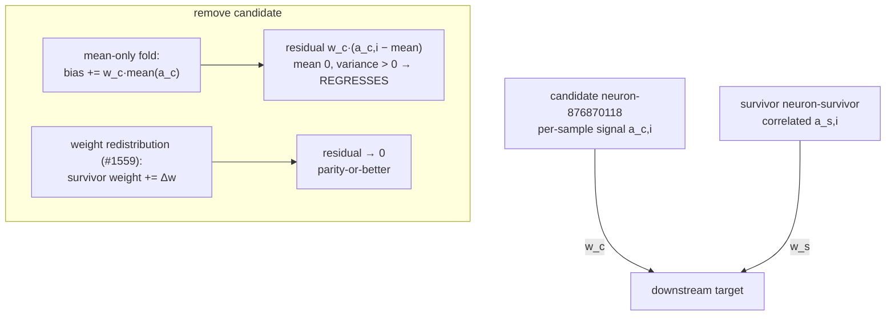

# PR Summary — Issue #1688

## Summary

TDD: reconstructs the remove-neuron **mean-only fold** failure class as a
committed, deterministic regression test *before* any behaviour change, giving
#1686's variance-aware wiring work an executable success oracle. Closes #1688.

The systematic root cause (confirmed in the #1686 grill): when NEAT-AI removes a
hidden neuron, the applier folds only the removed neuron's **mean** contribution
(`averageActivation × Σ outgoing weights`) into each downstream target's bias.
That cancels the *mean* of the removed contribution exactly — so every
scalar-aggregate view of the target is preserved and the removal looks safe — but
the neuron's per-sample **variance** signal is left uncompensated. Any downstream
target that relies on that signal regresses, even when the neuron is harmful in
aggregate. The #1558 study proved no scalar-aggregate adjustment fixes this; only
weight redistribution into a correlated survivor (#1559) — or, for a genuinely
constant neuron, a plain bias fold (#1623) — can.

This PR is **test-only**: it adds no live-path change and does not gate
provably-regressive removals at proposal time (propose-and-evaluate is kept).

## What changed

- Added `src/analysis/remove_neuron_regression_test.rs` — a checked-in fixture
  (no network access) distilled from the cached GRQ-cluster failure
  (GRQ-Discovery commit `c4330385fc65897c6caf1168d420d0e248d490da`, candidate
  UUID `neuron-876870118`; the NEAT-AI-side label truncation dropping the leading
  digit is cosmetic only). The module doc comment records the systematic root
  cause.
- Wired the module into `src/analysis/mod.rs` under `#[cfg(test)]` so `cargo test`
  compiles and runs it on every PR — it is **not** `#[ignore]`d, so a silent skip
  cannot mask a regression.

## Failure-class model



## Evidence

Backend/CLI change — no web interface to screenshot. Verified by the two new
tests (run with `--test-threads=1` per the shared-global-state convention):

```
running 2 tests
test analysis::remove_neuron_regression_test::compensated_removal_meets_parity_or_better ... ok
test analysis::remove_neuron_regression_test::mean_only_fold_regresses_variance_target ... ok

test result: ok. 2 passed; 0 failed; 0 ignored; 0 measured; 1287 filtered out
```

## Test Plan

- `src/analysis/remove_neuron_regression_test.rs::mean_only_fold_regresses_variance_target`
  — red-phase oracle: asserts the candidate carries per-sample variance, that the
  mean-only fold is aggregate-neutral (zero mean residual) yet leaves a strictly
  positive residual sum of squares (regression), and that the module's bias-only
  residual-variance accounting matches the directly simulated downstream error. If
  the fixture ever stops reproducing the class, this assertion fails loudly rather
  than passing vacuously.
- `src/analysis/remove_neuron_regression_test.rs::compensated_removal_meets_parity_or_better`
  — success oracle: asserts weight redistribution (#1559) is parity-or-better
  than the mean-only fold everywhere it regressed, drives the residual to ~0 for a
  perfectly-correlated survivor (`fully_compensable`), that `best_weight_redistribution`
  selects the correct survivor/target end to end, and that the #1623 bias fold
  correctly *rejects* the variance-carrying candidate rather than deleting it
  blind.
- Full `./quality.sh` (fmt, clippy `-D warnings`, check, test suite, release
  build) passes.
