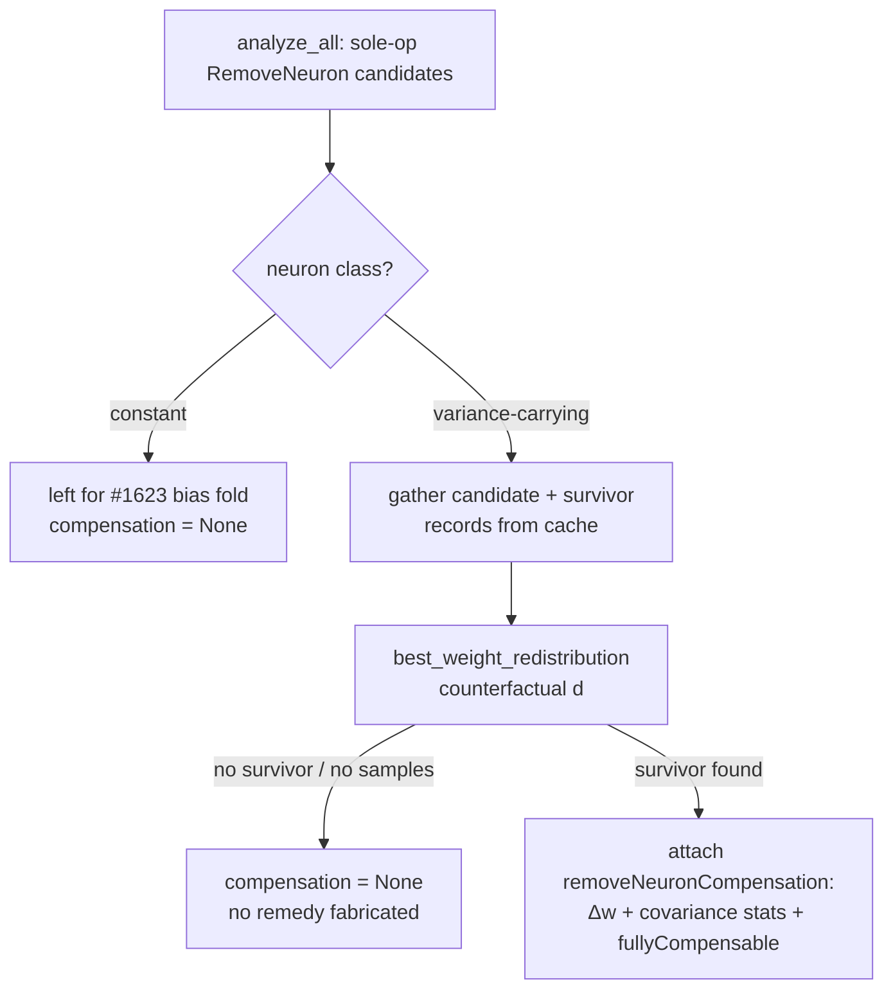

## Summary

Wire the **built-but-unwired** variance-aware compensation (Issue #1559) into the
live remove-neuron dispatch path so emitted `RemoveNeuron` candidates carry
covariance statistics and a weight-redistribution remedy. Closes #1689.

Milestone #1559 built the compensation API
(`evaluate_weight_redistribution`, `best_weight_redistribution`,
`shared_downstream_targets`, `ActivationCovariance` in
`src/analysis/remove_neuron_compensation.rs`) but nothing in the live pipeline
invoked it, so emitted candidates carried **no remedy** and the applier fell back
to the mean-only **bias** fold — which cancels only the removed neuron's *mean*
downstream contribution and leaves its per-sample (variance) signal to regress
the survivor (the #1558/#1686 failure class). This mirrors the wiring
`apply_honest_remove_neuron_gain` already added for the gain estimator
(#1516/#1523).

### What changed

- **`src/ffi_types/candidates.rs`** — added `RemoveNeuronCompensationJson` (the
  wire-format remedy: `targetNeuronUuid`, `survivorNeuronUuid`, `deltaWeight`,
  the compact covariance statistic — `sampleCount`, variances, covariance,
  correlation — plus `biasOnlyResidualVariance`, `redistributedResidualVariance`,
  `varianceRecovered`, `fullyCompensable`), and an optional
  `remove_neuron_compensation` field on `CoordinatedStructuralCandidateJson`
  (`skip_serializing_if = "Option::is_none"`, so uncompensated candidates
  serialise identically — backward compatible).
- **`src/analysis/discovery_dispatch.rs`** — added
  `apply_remove_neuron_compensation(creature, records, candidates)`. For each
  candidate whose **sole** op is a `RemoveNeuron`, it routes by neuron **class**:
  constant neurons are left for the #1623 bias-fold path; variance-carrying
  neurons get counterfactual (d) evaluated via `best_weight_redistribution`, and
  the winning survivor's `ActivationCovariance` is attached alongside. No remedy
  is fabricated when (d) cannot be evaluated (no shared-target survivor / no
  aligned records) — the field stays absent.
- **`src/analysis/orchestration.rs`** — invoked the new function in `analyze_all`
  immediately after the honest-gain override, gathering the involved neurons'
  per-sample records from the record cache in one pass.
- **Candidate construction sites** — added `remove_neuron_compensation: None` to
  every `CoordinatedStructuralCandidateJson` literal (a mechanical consequence of
  the new field; the value is only ever set by the dispatch path).
- **Docs** — `README.md` and `docs/IMPACT_CALCULATION.md` note the live-path
  wiring.

Propose-and-evaluate is preserved: provably-regressive removals are **not** gated
at proposal time — the remedy is attached and evaluation decides.

### Data flow

## Evidence

Backend/Rust change with no web interface to screenshot. Verified by unit tests
(`cargo test --lib analysis::discovery_dispatch` — 49 passed, including the 5 new
cases) and the full `./quality.sh` gate (fmt, clippy `-D warnings`, check, test,
release build).

The #1686/#1688 parity oracle in
`src/analysis/remove_neuron_regression_test.rs`
(`compensated_removal_meets_parity_or_better`) continues to pass, confirming the
wired remedy is parity-or-better than the mean-only fold.

## Test Plan

Added to `src/analysis/discovery_dispatch_tests.rs`:

- `remove_neuron_candidate_carries_covariance_and_redistribution` — a sole-op
  `RemoveNeuron` candidate with per-sample variance is emitted with covariance
  stats and a redistribution remedy (`deltaWeight ≈ 1.0`, `fullyCompensable`,
  `correlation ≈ 1.0`, positive `varianceRecovered`).
- `constant_neuron_candidate_is_not_given_redistribution` — routing test: a
  constant-neuron candidate is **not** compensated here even when a correlated
  shared-target survivor exists (it routes to #1623).
- `multi_op_candidate_gets_no_compensation` — multi-op candidates are untouched.
- `non_remove_neuron_candidate_gets_no_compensation` — non-`RemoveNeuron` single
  ops are untouched.
- `variance_candidate_without_records_gets_no_compensation` — no per-sample data
  ⇒ (d) cannot be evaluated, so no remedy is fabricated.
