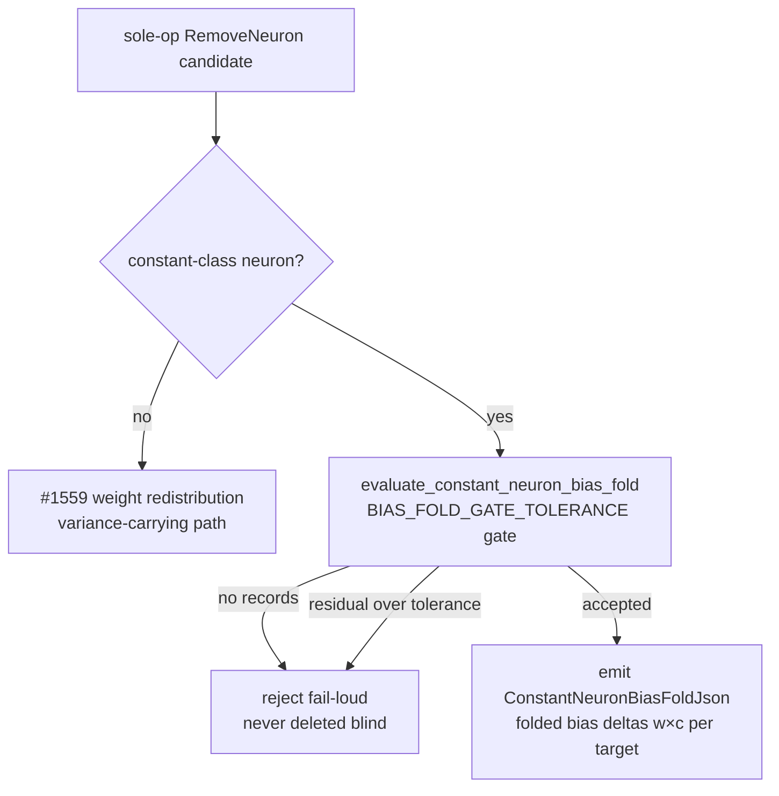

# [remove-neuron] Wire #1623 constant-neuron bias-fold into the live path

## Summary

Wires the **built-but-unwired** constant-neuron bias fold (Issue #1623) into the
live remove-neuron dispatch path, alongside the #1559 variance-redistribution
wiring (Issue #1689). A functionally-constant neuron carries no per-sample
variance, so folding its fixed contribution `w_{n→t} · c` into each downstream
target's bias is fully compensable — no survivor redistribution is needed. The
two remedies route by neuron **class** and are mutually exclusive per candidate.

Before this change, `evaluate_constant_neuron_bias_fold` /
`fold_and_remove_constant_neuron` were only re-exported in `analysis/mod.rs` with
no live caller, so a genuinely-constant remove-neuron candidate carried no remedy
and the applier fell back to a mean-only fold. Now the live path emits the folded
per-target bias deltas with the candidate so the applier (cross-repo sub-issue)
folds the constant contribution into downstream biases rather than folding a mean.

Key points:

- New `apply_constant_neuron_bias_fold` in `src/analysis/discovery_dispatch.rs`
  routes every sole-op `RemoveNeuron` candidate whose removed neuron is
  constant-class through `evaluate_constant_neuron_bias_fold`, behind the
  evaluate-before-accept gate (`BIAS_FOLD_GATE_TOLERANCE`).
- On acceptance, the folded deltas (`w × c` per target) plus the constant, the
  variance, and the max residual are emitted on the candidate via a new
  `ConstantNeuronBiasFoldJson` / `FoldedBiasDeltaJson`.
- A neuron that only *looks* constant (records vary over tolerance) or has **no**
  recorded activations is **rejected fail-loud** — no fold is emitted and the
  creature is never mutated (never deleted blind), as the #1623 API already
  enforces.
- Routing is by class and mutually exclusive with #1559: constant neurons take
  the bias fold, variance-carrying neurons take weight redistribution.
- Wired into the live pipeline in `src/analysis/orchestration.rs`, reusing the
  per-sample records already gathered for the #1559 pass.

Closes #1690.

## Evidence

This is a backend/library change with no web interface to screenshot. Evidence is
the TDD test suite below plus the green quality gate (`./quality.sh` — fmt,
clippy `-D warnings`, `cargo check`, doc build, full test suite, release build).

### Routing and gating flow

## Test Plan

TDD-first integration suite added at
`tests/analysis/issue_1690_constant_bias_fold_wiring.rs` (registered in
`tests/analysis/main.rs`):

- `constant_neuron_candidate_carries_bias_fold` — a genuinely-constant candidate
  is emitted with folded deltas (`w × c`, e.g. `2.0 × 3.0 = 6.0`), zero variance,
  residual within tolerance.
- `emitted_deltas_match_the_accepted_fold` — emitted per-target deltas match the
  accepted `BiasFoldOutcome` across a multi-target fan-out.
- `bias_fold_and_redistribution_are_mutually_exclusive` — a constant neuron gets
  the fold and **no** redistribution; a variance-carrying neuron gets
  redistribution and **no** fold.
- `looks_constant_over_tolerance_is_rejected_fail_loud` — records varying over
  tolerance produce no fold (rejected, never deleted blind).
- `constant_neuron_without_records_is_rejected_fail_loud` — no recorded
  activations produce no fold.
- `multi_op_candidate_gets_no_bias_fold` /
  `non_remove_neuron_candidate_gets_no_bias_fold` — only bare sole-op
  `RemoveNeuron` candidates are routed.

Existing suites stay green: the #1623 helper suite
(`tests/analysis/issue_1623_constant_neuron_bias_fold.rs`) and the #1689 dispatch
tests (`apply_remove_neuron_compensation`, `apply_honest_remove_neuron_gain`) all
pass unchanged.
