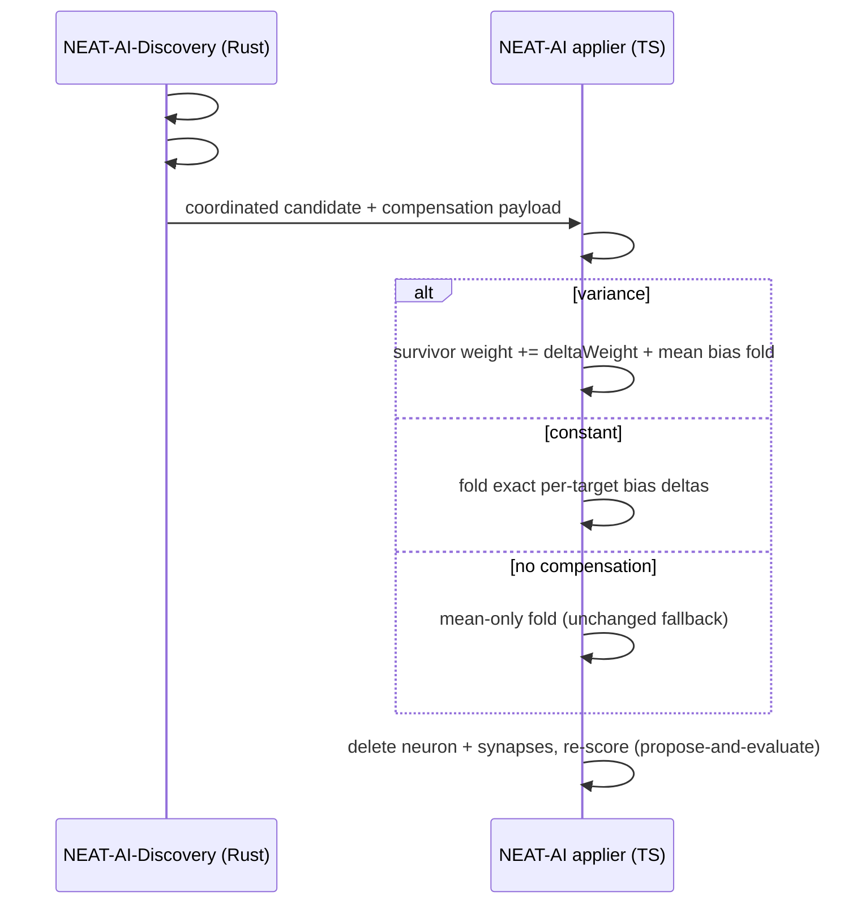

# PR Summary — Cross-repo: NEAT-AI applier consumes compensation data

## Summary

This is the **tracking sub-issue** for wiring the variance-aware remove-neuron
compensation into the live applier. NEAT-AI-Discovery already **emits** the
compensation on remove-neuron candidates (the #1559 weight-redistribution wiring
in #1689 and the #1623 constant bias-fold wiring in #1690). The applier that must
**consume** it lives in the separate **stSoftwareAU/NEAT-AI** repository, so the
fix was driven there and is linked back here per the #1686 accepted cross-repo
scope.

The NEAT-AI applier previously folded only a removed neuron's **mean** downstream
contribution into the downstream biases (the "mean-only fold") — the source of
the #1686 regression class for variance-carrying neurons. The companion PR makes
it consume the emitted compensation instead:

- **variance-carrying candidate** (`removeNeuronCompensation`): bump the
  correlated survivor's synapse weight into the shared target by `deltaWeight`
  **in addition to** the mean bias fold;
- **constant candidate** (`constantNeuronBiasFold`): apply the exact pre-computed
  per-target bias deltas;
- **no compensation present**: byte-identical fallback to today's mean-only fold,
  so mixed-version pipelines stay safe.

Propose-and-evaluate is preserved: the applier applies the remedy the pipeline
chose; it does not re-gate removals.

Closes #1691.

## Companion (where the applier fix lives)

- **Issue:** stSoftwareAU/NEAT-AI#3414
- **PR:** stSoftwareAU/NEAT-AI#3415 — *[remove-neuron] Applier consumes
  variance-aware compensation, not mean-only fold*

The companion PR is **not** auto-merged from here; releasing/merging it is a human
decision (Issue #2944). No NEAT-AI-Discovery release is required — the applier PR
consumes the payload NEAT-AI-Discovery already emits.

## Emission → consumption (cross-repo)

## Evidence

Emission-side (this repo) is unchanged and already covered by the #1689/#1690
suites. The consuming applier and its tests live in the companion PR:
`test/ErrorGuidedStructuralEvolution/DiscoveryNeuronRemoval.ts` covers the three
failure-detection cases (variance weight-bump + fold + parity, constant exact
deltas, and byte-identical no-compensation fallback), and the existing
`DiscoveryApplication.ts` suite stays green. Verified there with `deno test`,
`deno check` (repo-wide), `deno lint`, and `deno fmt`.

This is a backend/cross-repo tracking change — no web interface to screenshot.

## Test Plan

- Companion PR NEAT-AI#3415 adds
  `test/ErrorGuidedStructuralEvolution/DiscoveryNeuronRemoval.ts` (three cases)
  and a `shortID` regression test, and keeps the existing suites green.
- No NEAT-AI-Discovery source changed by this tracking PR; `cargo`-side quality
  gates are unaffected.
