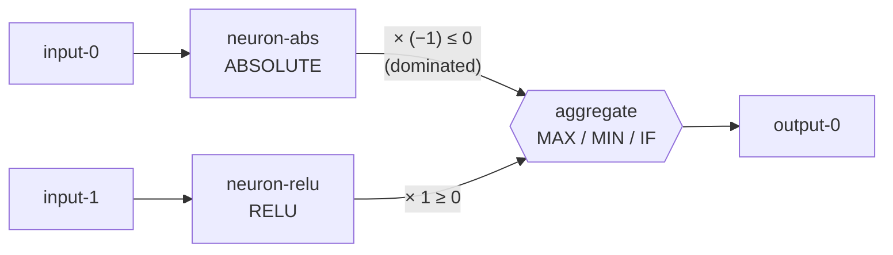

# PR Summary — Issue #1705

## Summary

Commit the test fixtures the #1704 dominated-branch collapse and
contribution-propagation characterisation suites (#1706–#1708) depend on.
**Fixtures only — no engine behaviour changes.** Because the contribution ground
truth is the **private** production discovery candidate cache, the
fixtures are committed to this repository and loaded from disk, never fetched at
runtime. Closes #1705.

New fixtures under `tests/fixtures/dominated_branch_collapse/`:

- **Three minimal synthetic networks** (one per selection aggregate type)
  reproducing the worked-example shape — a selection aggregate fed by two
  branches, one analytically dominated (`ABSOLUTE × (−1)`, always ≤ 0) versus a
  `RELU` branch (always ≥ 0):
  - `networks/maximum_aggregate.json` — MAXIMUM aggregate (ABSOLUTE branch
    dominated).
  - `networks/minimum_aggregate.json` — MINIMUM aggregate (RELU branch
    dominated).
  - `networks/if_aggregate.json` — IF aggregate with an explicit **condition**
    synapse plus `positive` (RELU) and `negative` (ABSOLUTE) branches.
- **Candidate-cache-shaped records** mirroring real cache entries:
  - `candidate_cache/v2_change-squash_selu-to-absolute.json` — the inspected
    failed `change-squash` (SELU→ABSOLUTE, 2026-07-16, discoveryVersion
    `0.74.131`): predicted `expectedErrorReduction = +4.2e-10` versus measured
    `actualErrorReduction = −8.7e-4`.
  - `candidate_cache/d1ac1f41.json` — the `d1ac1f41` shape: 1 success
    (remove-neuron) versus 5 failures (1 change-squash, 4 remove-neuron).
- **Provenance manifest** — `README.md` documenting which cache entry each
  fixture derives from (the source repo is private), with one row per committed
  fixture file.

## Evidence

Backend/test-only change — no web interface to screenshot. Verification is the
offline-loading smoke test, run without network access:



```text
running 5 tests
test manifest_covers_every_fixture ... ok
test change_squash_record_loads_offline ... ok
test d1ac1f41_shape_loads_offline ... ok
test networks_load_offline ... ok
test fixtures_load_offline ... ok

test result: ok. 5 passed; 0 failed; 0 ignored; 0 measured; 0 filtered out
```

TDD linkage: temporarily removing `networks/if_aggregate.json` makes
`fixtures_load_offline` fail loudly with the missing fixture path, confirming the
smoke test genuinely guards fixture presence rather than passing vacuously.

## Test Plan

Added `tests/collapse_fixtures.rs` (the failure-detection smoke test named in the
issue). It deserialises every fixture offline and asserts the expected counts and
pinned values:

- `networks_load_offline` — the three networks deserialise into `CreatureJson`,
  each carrying its ABSOLUTE/RELU branches and the correct aggregate squash; the
  IF fixture carries `condition`, `positive`, and `negative` synapses.
- `change_squash_record_loads_offline` — the SELU→ABSOLUTE record pins
  `expectedErrorReduction = +4.2e-10` and `actualErrorReduction = −8.7e-4`
  (positive prediction, negative measurement).
- `d1ac1f41_shape_loads_offline` — 1 remove-neuron success versus 5 failures
  (1 change-squash, 4 remove-neuron).
- `manifest_covers_every_fixture` — the provenance `README.md` has one entry per
  committed fixture file.
- `fixtures_load_offline` — the aggregate offline-load guard asserting three
  networks plus every candidate-cache record load without network access.

No existing tests were modified. `Cargo.toml` version bumped `0.74.147 →
0.74.148` per the repository's version-on-change invariant.
