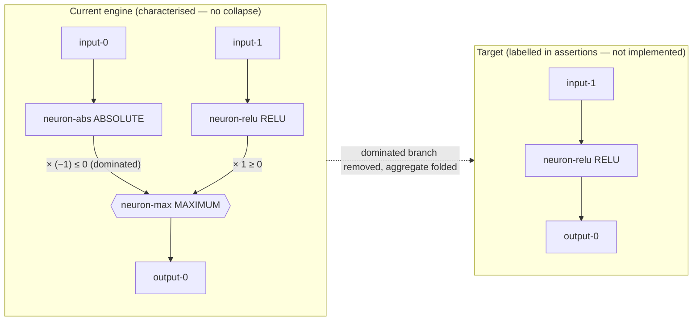

# PR summary — Issue #1706

## Summary

Adds the **characterisation** suite documenting the *extent* to which dominated
branches feeding selection aggregates (MAXIMUM, MINIMUM, IF including IF
condition synapses) are detected and could collapse in the Rust discovery engine
today. No engine behaviour is changed — the tests pin the *current* engine
output for the committed #1705 fixtures and, in each `current vs target`
assertion, name the full-collapse target the engine does not yet reach. Also
adds the extent report capturing partial-dominance findings for the #1708
sub-issue. Closes #1706.

Two facts are held together per aggregate:

1. **Dominance is real** — proven in-test on both bases the issue asks for:
   - *Analytical* (activation range × weight sign): `ABSOLUTE(x) ≥ 0` scaled by
     `−1` is always `≤ 0`; `RELU(x) ≥ 0` scaled by `+1` is always `≥ 0`, so the
     ABSOLUTE branch can never win a MAXIMUM and the RELU branch can never win a
     MINIMUM.
   - *Empirical*: over a sampled observation window the dominated branch never
     wins the aggregate's selection.
2. **The engine does not collapse it** — the nearest transform today
   (constant-neuron bias-fold removal, #1620/#1623) flags nothing via
   `functionally_constant_neuron_uuids`; there is no analytical-dominance proof
   in the engine, so the dominated (non-constant) branch survives.

The worked example (`InputA → ABSOLUTE × (−1)` vs `InputB → RELU` into MAX) has a
dedicated test asserting today's non-collapse — the earliest CI detection point.

## Evidence

Backend/test-only change — no web interface to screenshot. Verified by the new
test suite (11 tests, all passing):

```
cargo test --test issue_1706_dominated_branch_characterisation
running 11 tests ... test result: ok. 11 passed; 0 failed
```



Full extent report (current vs target table, dominance bases, and
partial-dominance findings F1–F3): `docs/DOMINATED_BRANCH_COLLAPSE_EXTENT.md`.

## Test Plan

New file `tests/issue_1706_dominated_branch_characterisation.rs` (11 tests):

- MAX: `max_dominated_branch_analytically_provable`,
  `max_dominated_branch_empirically_never_wins`,
  `worked_example_max_current_non_collapse` (worked example / earliest CI
  detection point).
- MIN: `min_dominated_branch_analytically_provable`,
  `min_dominated_branch_empirically_never_wins`, `min_current_non_collapse`.
- IF (condition synapses): `if_condition_synapse_present_and_typed`,
  `if_negative_branch_empirically_dominated_when_condition_positive`,
  `if_dominance_is_conditional_not_global` (partial-dominance finding F1),
  `if_current_non_collapse`.
- Cross-aggregate: `no_aggregate_fixture_collapses_today`.

Fixture drift is caught at load — the loaders panic on a missing/malformed
fixture. Existing `tests/collapse_fixtures.rs` smoke tests are untouched.

Version bumped `0.74.148 → 0.74.149`.
