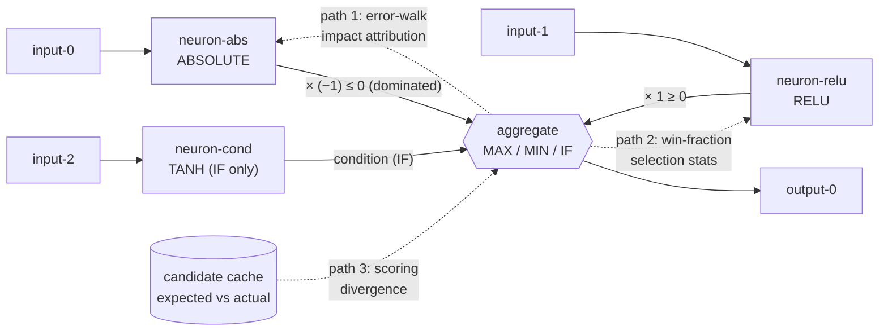

# Characterisation tests: contribution propagation through MAX/MIN/IF (Issue #1707)

## Summary

Adds fixture-backed **characterisation** tests (no engine changes) for whether
contribution logic breaks down through the selection aggregates (MAX/MIN/IF) —
the suspected root cause of Discovery producing no successful candidates. The
suite pins current behaviour over the committed production discovery-cache fixtures from the
fixtures sub-issue (#1705) across all three propagation paths the parent
investigation (#1704) names. Closes #1707.

New file `tests/contribution_propagation_characterisation.rs` with the three
cases named in the issue's failure-detection section:

- `error_walk_attribution_through_max_min_if` — **path 1**
- `win_fraction_selection_stats_match_fixtures` — **path 2 (canary)**
- `expected_vs_actual_error_reduction_divergence` — **path 3**

No production code changed; version bumped `0.74.149 → 0.74.150`.

### Path 1 — error-walk attribution (divergence characterised)

Compares the empirical impact walk (`compute_impacts_with_activations`, driven by
selection stats) against the no-records `1/N` fallback (`compute_impacts_public`).
The divergence hunted here: **without activation records the walk splits impact
`1/N` uniformly across every branch** —

- MAX/MIN: the provably dominated branch is mis-credited a full `0.5` share it
  never earns (empirical walk correctly gives it `~0`).
- IF: the always-active condition synapse is under-credited (`1/3` vs `1.0`) and
  the never-selected negative branch over-credited (`1/3` vs `0.0`).

### Path 2 — win-fraction selection stats (canary, asserts *correct* behaviour)

Per NEAT-AI-Explore#513, `compute_selection_stats` win-fraction attribution is
correct, so this case asserts the **correct** win fractions (dominated branch
`0.0`, winning branch `1.0`, IF condition `1.0`). Any future failure here is a
true regression, not a characterised defect.

### Path 3 — expected vs actual error reduction (divergence characterised)

Driven straight from the committed candidate-cache fixtures:

- The concrete `change-squash` SELU→ABSOLUTE misprediction — predicted
  **+4.2e-10**, measured **−8.7e-4**: a sign flip with a `>1e5×` magnitude gap.
  Fed back through the calibration it collapses the change-squash correction to
  the floor (`MIN_CALIBRATION_CORRECTION`).
- The `d1ac1f41` **1-success / 5-failure** set: every one of the 5 failures
  predicted an improvement yet measured harm, so the aggregate expected-vs-actual
  **divergence rate is 5/6 (83.3%)**; the single success is the only
  non-divergent outcome.

Divergences are **characterised, not fixed** — captured here for the
extent-report sub-issue under #1704. Path 3 notes the dependency on NEAT-AI#3389
(MAX/MIN/IF aggregates recording their own value/errors) in the source comments.

## Evidence

Backend/test-only change — no web interface to screenshot. Verified via
`cargo test`:

```
running 3 tests
test expected_vs_actual_error_reduction_divergence ... ok
test win_fraction_selection_stats_match_fixtures ... ok
test error_walk_attribution_through_max_min_if ... ok

test result: ok. 3 passed; 0 failed; 0 ignored; 0 measured; 0 filtered out
```

`cargo fmt --all --check`, `cargo clippy --all-targets --all-features -D warnings`
pass clean; sibling suites (`collapse_fixtures`, `issue_1706_...`) still green.

### Propagation paths under test



## Test Plan

`tests/contribution_propagation_characterisation.rs`:

- `win_fraction_selection_stats_match_fixtures` — asserts correct MAX/MIN/IF win
  fractions from `compute_selection_stats` over the three network fixtures
  (path 2 canary).
- `error_walk_attribution_through_max_min_if` — asserts the empirical-vs-fallback
  impact-attribution divergence through each aggregate (path 1).
- `expected_vs_actual_error_reduction_divergence` — asserts the `change-squash`
  SELU→ABSOLUTE misprediction, the `d1ac1f41` 1/5 split, the 5/6 divergence
  rate, and the resulting calibration corrections (path 3).

All three load committed fixtures offline and fail loud on missing/altered
fixtures (explicit fixture-path panic), never fetching at runtime.
